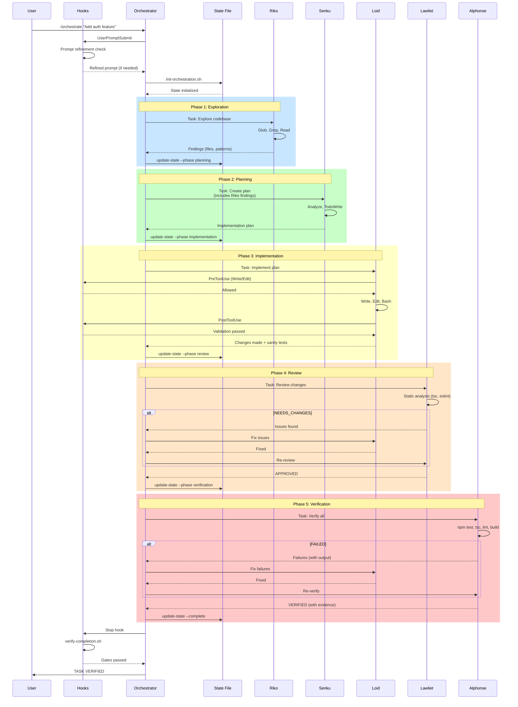
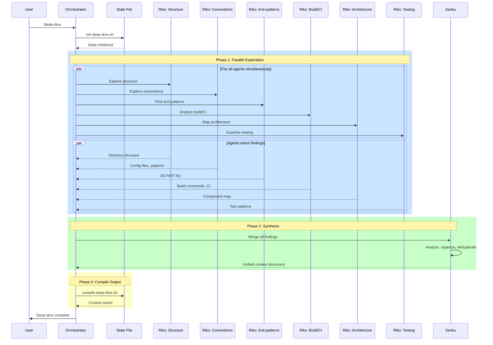
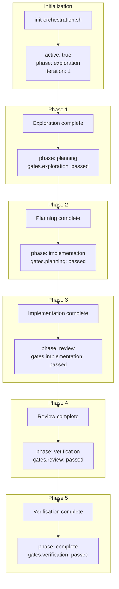
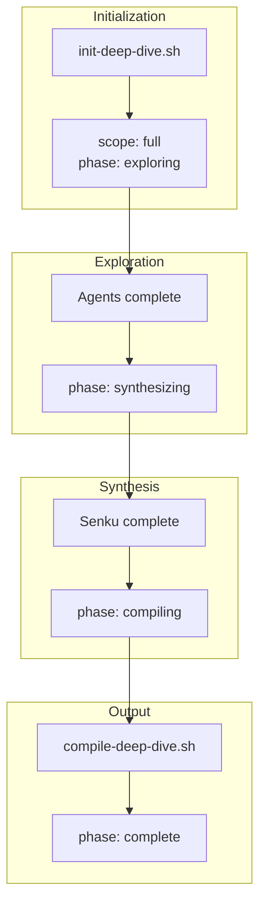
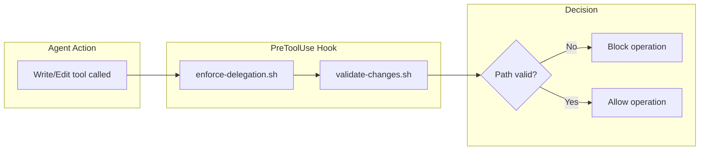
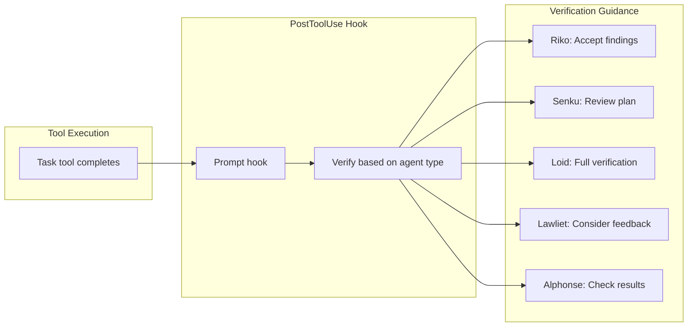
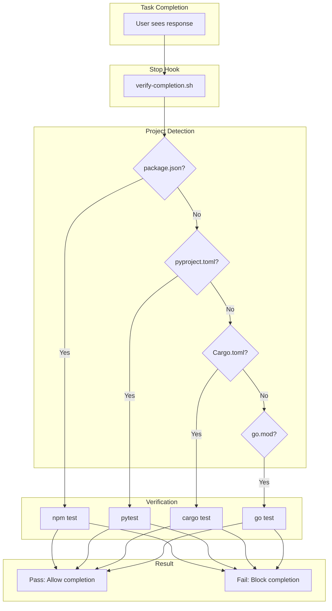
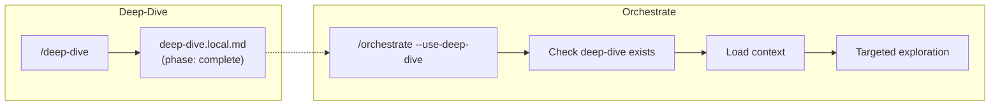
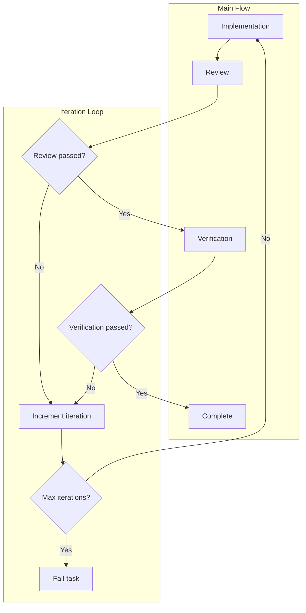

# Data Flows

Detailed sequence diagrams showing how data flows through Agent Flow during orchestration and deep-dive workflows.

## Orchestration Data Flow

### Complete Workflow Sequence

### Data Passed Between Phases

| From | To | Data |
|------|-----|------|
| User | Orchestrator | Task description |
| Hooks | Orchestrator | Refined prompt |
| Orchestrator | State | Phase transitions, gate results |
| Riko | Orchestrator | Files, patterns, architecture |
| Orchestrator | Senku | Task + Riko's findings |
| Senku | Orchestrator | Implementation plan |
| Orchestrator | Loid | Plan + context |
| Loid | Orchestrator | Changed files + test results |
| Orchestrator | Lawliet | Changed files list |
| Lawliet | Orchestrator | Review verdict + issues |
| Orchestrator | Alphonse | Full codebase |
| Alphonse | Orchestrator | Verification evidence |

## Deep-Dive Data Flow

### Parallel Exploration Sequence

### Data Gathered by Each Agent

| Agent | Explores | Output |
|-------|----------|--------|
| Structure | Directory layout | Entry points, packages, organization |
| Conventions | Config files | Naming patterns, style rules |
| Anti-patterns | Comments, docs | DO NOT list, warnings |
| Build/CI | Scripts, workflows | Test commands, CI pipeline |
| Architecture | Source code | Component map, dependencies |
| Testing | Test files | Framework, patterns, utilities |

## State File Data Flow

### Orchestration State Updates

### Deep-Dive State Updates

## Hook Data Flow

### PreToolUse Flow

### PostToolUse Flow

### Stop Hook Flow

## Integration Points

### Deep-Dive to Orchestrate

### Iteration Loop

## Related Documentation

- [Architecture Overview](overview.md) - System design
- [Commands Reference](../reference/commands.md) - Command specifications
- [Hooks Reference](../reference/hooks.md) - Hook system details
- [State Files Reference](../reference/state-files.md) - State file formats
