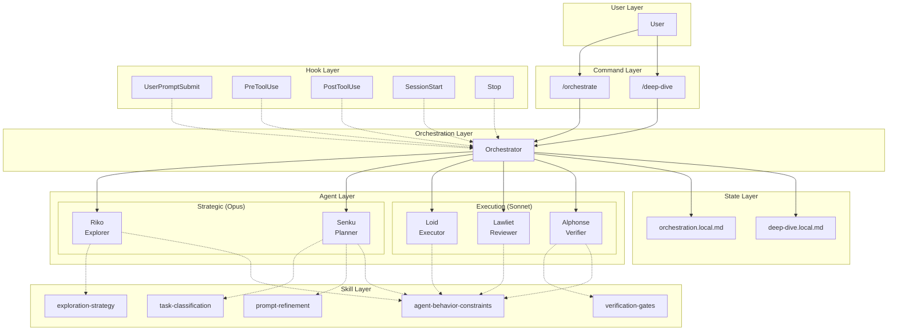
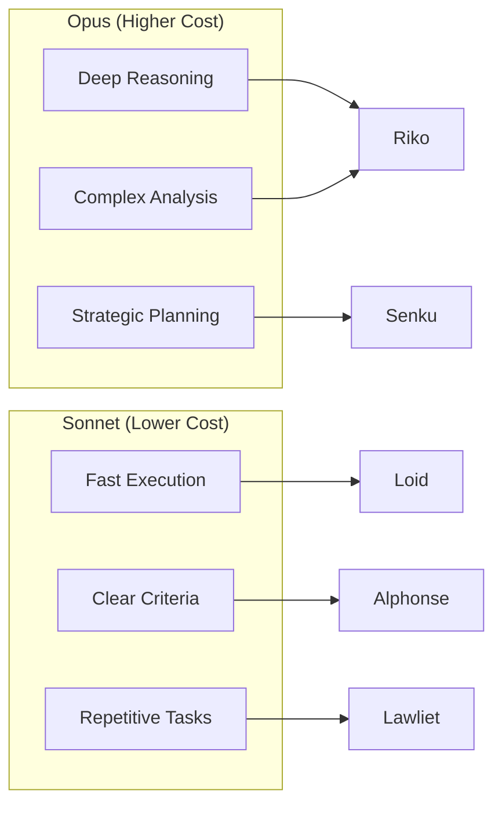

# System Architecture Overview

Agent Flow transforms Claude Code into a multi-agent orchestrated system with verification gates. This document explains how the components fit together and why the system is designed this way.

## Design Philosophy

Agent Flow is built on three core principles:

1. **Specialization over generalization** - Each agent has a focused role with specific tools
2. **Verification over trust** - Every claim must be backed by evidence
3. **Cost awareness over convenience** - Use expensive models only where they add value

## High-Level Architecture



## Component Overview

### Command Layer

Commands are the entry points for multi-agent workflows:

| Command | Purpose | Output |
|---------|---------|--------|
| `/orchestrate` | Execute complex tasks through agent pipeline | Modified files, verified |
| `/deep-dive` | Gather comprehensive codebase context | `.claude/deep-dive.local.md` |

### Orchestration Layer

The orchestrator is the main Claude instance that:
- Receives user requests
- Delegates to specialist agents
- Passes context between phases
- Enforces verification gates
- Reports completion status

The orchestrator **never** implements code directly - it coordinates specialists.

### Agent Layer

Five specialized agents handle different aspects of development:

| Agent | Model | Role | Key Tools |
|-------|-------|------|-----------|
| Riko | Opus | Codebase exploration | Read, Grep, Glob, WebSearch |
| Senku | Opus | Implementation planning | Read, Grep, Glob, TodoWrite |
| Loid | Sonnet | Code implementation | Read, Write, Edit, Bash |
| Lawliet | Sonnet | Code review | Read, Grep, Glob, Bash |
| Alphonse | Sonnet | Verification | Bash, Read, Grep |

See [Agent Reference](../reference/agents.md) for detailed specifications.

### Skill Layer

Skills are domain expertise modules that provide behavioral patterns:

| Skill | Owner | Purpose |
|-------|-------|---------|
| exploration-strategy | Riko | Codebase exploration patterns |
| task-classification | Senku | Task routing decisions |
| prompt-refinement | Senku | Ambiguous request handling |
| verification-gates | Alphonse | Quality validation patterns |
| agent-behavior-constraints | System | Universal behavioral rules |

See [Skills Reference](../reference/skills.md) for detailed specifications.

### Hook Layer

Hooks provide lifecycle automation:

| Hook | Trigger | Purpose |
|------|---------|---------|
| UserPromptSubmit | User sends message | Prompt refinement |
| PreToolUse | Before tool execution | Delegation guidance, validation |
| PostToolUse | After tool execution | Result verification |
| SessionStart | Session begins | Project context detection |
| Stop | Task completion | Verification gates |

See [Hooks Reference](../reference/hooks.md) for detailed specifications.

### State Layer

State files track workflow progress:

| File | Scope | Content |
|------|-------|---------|
| `orchestration.local.md` | Session | Phase, iteration, gate results |
| `deep-dive.local.md` | Session | Codebase context, patterns |

See [State Files Reference](../reference/state-files.md) for format specifications.

## Information Flow

### Orchestration Flow

```
User Request
    |
    v
[Prompt Refinement] -- If vague, ask clarification
    |
    v
[Riko: Exploration] -- Gather codebase context
    |
    v
[Senku: Planning] -- Create implementation strategy
    |
    v
[Loid: Implementation] -- Write code
    |
    v
[Lawliet: Review] -- Check code quality
    |
    v
[Alphonse: Verification] -- Run all tests
    |
    v
Task Complete (verified)
```

### Deep-Dive Flow

```
User Request
    |
    v
[Parallel Riko Agents] -- 5+ concurrent explorations
    |                      - Structure
    |                      - Conventions
    |                      - Anti-patterns
    |                      - Build/CI
    |                      - Architecture
    |                      - Testing
    v
[Senku: Synthesis] -- Merge findings
    |
    v
deep-dive.local.md -- Reusable context
```

## Model Selection Strategy

Agent Flow optimizes costs by matching model capabilities to task requirements:



**Use Opus when:**
- Exploring unfamiliar codebases
- Designing complex architectures
- Making strategic decisions
- Analyzing ambiguous requirements

**Use Sonnet when:**
- Implementing well-defined plans
- Running verification commands
- Performing code review
- Executing repetitive operations

## Tool Access Control

Agents have restricted tool access based on their roles:

```
Riko (Explorer):     [Read] [Grep] [Glob] [WebSearch] [WebFetch]
Senku (Planner):     [Read] [Grep] [Glob] [TodoWrite]
Loid (Executor):     [Read] [Write] [Edit] [Bash] [Grep] [Glob]
Lawliet (Reviewer):  [Read] [Grep] [Glob] [Bash]
Alphonse (Verifier): [Read] [Bash] [Grep]
```

Key restrictions:
- **Only Loid** can modify files (Write, Edit)
- **Only Riko** can access the web (WebSearch, WebFetch)
- **Only Senku** can manage tasks (TodoWrite)

This ensures separation of concerns and prevents agents from exceeding their responsibilities.

## Verification Architecture

Verification is layered throughout the system:

```
┌─────────────────────────────────────────────────────────┐
│                    Verification Layers                   │
├─────────────────────────────────────────────────────────┤
│ Layer 1: Agent Self-Check                               │
│   - Loid runs sanity tests during implementation        │
│   - Lawliet runs static analysis during review          │
├─────────────────────────────────────────────────────────┤
│ Layer 2: Dedicated Verifier                             │
│   - Alphonse runs full test suite                       │
│   - Alphonse verifies types, lint, build                │
├─────────────────────────────────────────────────────────┤
│ Layer 3: Hook Enforcement                               │
│   - Stop hook runs verification before completion       │
│   - PostToolUse validates delegation results            │
├─────────────────────────────────────────────────────────┤
│ Layer 4: Orchestrator Gates                             │
│   - Must see actual command output                      │
│   - Must confirm zero errors                            │
│   - Must see all required checks pass                   │
└─────────────────────────────────────────────────────────┘
```

## Extension Points

Agent Flow is designed to be extensible:

| Extension Type | Location | Process |
|---------------|----------|---------|
| New Agent | `agents/*.md` | Define role, model, tools, skills |
| New Skill | `skills/*/SKILL.md` | Define domain expertise, references |
| New Command | `commands/*.md` | Define workflow, state management |
| New Hook | `hooks/hooks.json` | Define trigger, matcher, action |

See the extension guides:
- [Adding Agents](../guides/adding-agents.md)
- [Adding Skills](../guides/adding-skills.md)

## Related Documentation

- [Data Flows](data-flows.md) - Detailed sequence diagrams
- [Design Decisions](design-decisions.md) - Architectural decision records
- [Agent Reference](../reference/agents.md) - Complete agent specifications
- [Commands Reference](../reference/commands.md) - Command specifications
