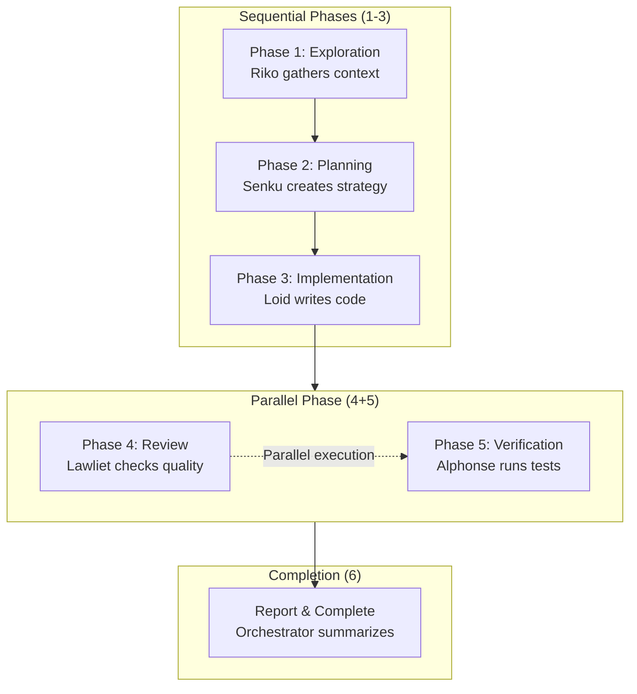
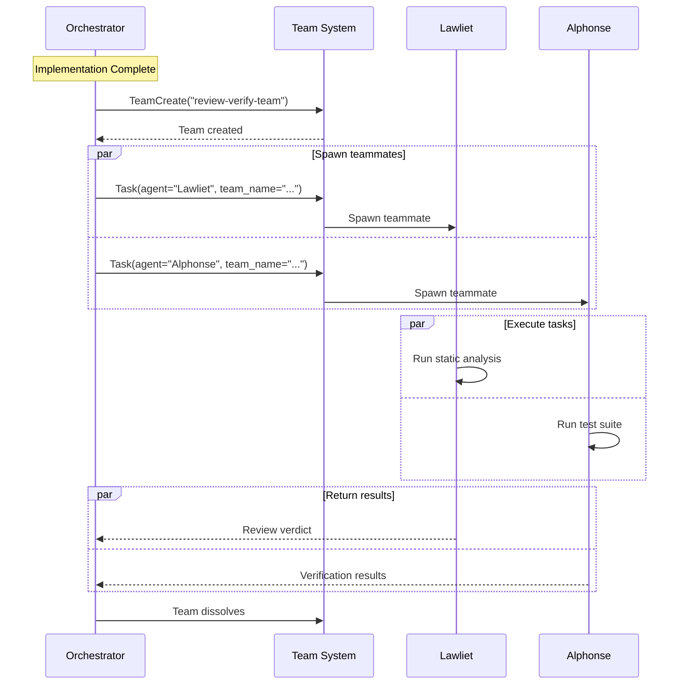
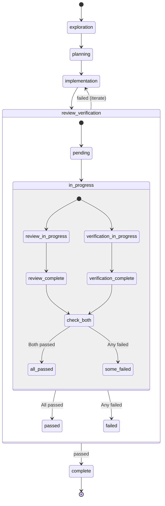
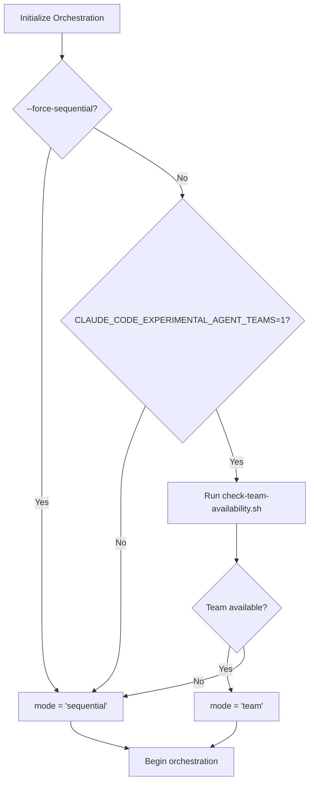
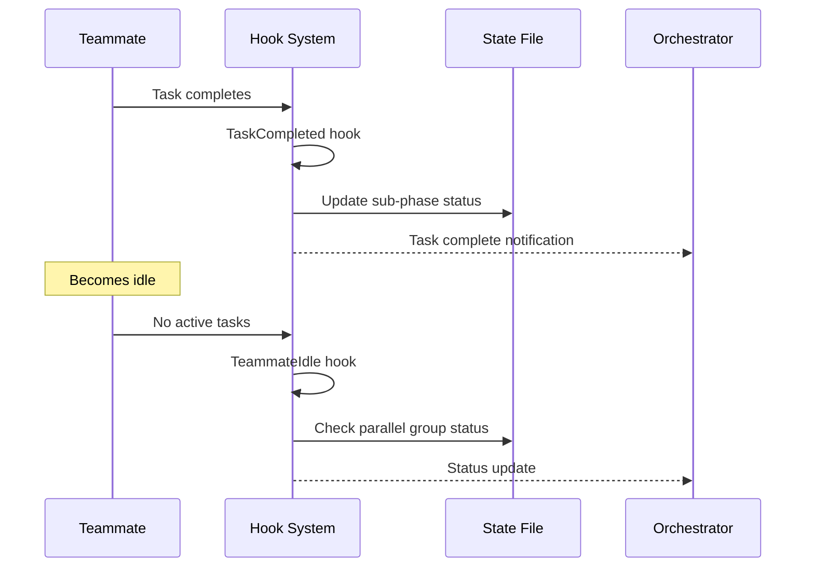

# Team Orchestration Architecture

Understanding Agent Flow's hybrid workflow model: sequential phases for planning, parallel execution for review and verification using Agent Teams.

## Motivation: Why Agent Teams Add Value

Traditional sequential workflows enforce a strict ordering: implement → review → verify. While this ensures correctness, it introduces unnecessary latency when review and verification can safely run in parallel.

### The Opportunity

Review (static analysis) and verification (test execution) are independent operations:
- **Review** analyzes code without running it
- **Verification** runs tests without examining code structure

These phases share no state, modify no files, and can execute concurrently.

### The Benefit

Parallelizing review and verification provides:
- **Reduced latency**: Both phases complete simultaneously
- **Faster feedback cycles**: Issues discovered in parallel
- **Cost efficiency**: Same token usage, less wall-clock time
- **Better resource utilization**: Both Sonnet agents work concurrently

### When Agent Teams Aren't Available

The system gracefully degrades to sequential execution when:
- Agent Teams feature is disabled (`CLAUDE_CODE_EXPERIMENTAL_AGENT_TEAMS` not set)
- User explicitly requests sequential mode (`--force-sequential` flag)
- Team creation fails for any reason

This ensures reliable operation regardless of environment.

## Hybrid Workflow Model

Team orchestration combines sequential and parallel execution patterns.

### Workflow Phases



### Sequential vs Parallel Execution

| Phase | Sequential Mode | Team Mode |
|-------|----------------|-----------|
| 1: Exploration | Riko explores | Riko explores |
| 2: Planning | Senku plans | Senku plans |
| 3: Implementation | Loid implements | Loid implements |
| 4: Review | Lawliet reviews → wait | Lawliet reviews \|\| |
| 5: Verification | Wait → Alphonse verifies | \|\| Alphonse verifies |
| 6: Completion | Report results | Report results |

**Key insight**: Sequential phases (1-3) ensure proper context flow. Parallel phases (4-5) optimize independent verification tasks.

## Team Composition

Teams are ephemeral, created for a single orchestration session.

### Team Lifecycle



### Team Members

| Role | Agent | Task | Duration |
|------|-------|------|----------|
| Reviewer | Lawliet | Static analysis, pattern checks | Until verdict |
| Verifier | Alphonse | Test suite, build, type check | Until verified |

**Important**: The orchestrator coordinates but does not join the team. It spawns teammates, collects results, and merges outcomes.

### Communication Pattern

```
Orchestrator
    ├── TeamCreate("review-verify-team")
    ├── Task(agent="Lawliet", team_name="review-verify-team")
    │   └── Lawliet teammate (reviews independently)
    ├── Task(agent="Alphonse", team_name="review-verify-team")
    │   └── Alphonse teammate (verifies independently)
    ├── SendMessage(recipient=lawliet_id, message="Final verdict?")
    ├── SendMessage(recipient=alphonse_id, message="Verification status?")
    └── Merge results → Proceed or iterate
```

## State Management

Team orchestration tracks both traditional phases and parallel group status.

### State File Structure

The state file `.claude/team-orchestration.local.md` extends orchestration state with parallel group tracking:

```yaml
---
active: true
current_phase: "review_verification"
iteration: 1
mode: "team"
team_available: true
parallel_groups:
  review_verification:
    status: "in_progress"
    started_at: "2024-01-15T10:45:00Z"
    completed_at: ""
    review:
      status: "passed"
      agent: "Lawliet"
      timestamp: "2024-01-15T10:46:30Z"
      result: "APPROVED"
    verification:
      status: "in_progress"
      agent: "Alphonse"
      timestamp: "2024-01-15T10:45:15Z"
      result: ""
gates:
  exploration:
    status: "passed"
  planning:
    status: "passed"
  implementation:
    status: "passed"
  review_verification:
    status: "in_progress"
  review:
    status: "passed"
  verification:
    status: "in_progress"
---
```

### Parallel Group Status

| Status | Meaning | Next Action |
|--------|---------|-------------|
| `pending` | Not started | Wait for implementation |
| `in_progress` | Teammates active | Poll for completion |
| `passed` | All sub-phases passed | Proceed to completion |
| `failed` | One or more failed | Iterate back to implementation |

### Sub-Phase Tracking

Each parallel group contains sub-phases (review, verification) tracked independently:

```yaml
review:
  status: "passed"        # pending, in_progress, passed, failed
  agent: "Lawliet"
  timestamp: "..."
  result: "APPROVED"      # APPROVED, NEEDS_CHANGES, or error details

verification:
  status: "passed"
  agent: "Alphonse"
  timestamp: "..."
  result: "VERIFIED"      # VERIFIED, FAILED, or failure details
```

### State Transitions



## Fallback Mechanism

The system ensures reliable operation through automatic fallback.

### Detection Flow



### Fallback Triggers

| Condition | Mode | Reason |
|-----------|------|--------|
| `CLAUDE_CODE_EXPERIMENTAL_AGENT_TEAMS` not set | sequential | Feature disabled |
| `--force-sequential` flag present | sequential | User override |
| `check-team-availability.sh` fails | sequential | Runtime unavailability |
| Team creation fails | sequential | Graceful degradation |

### Behavior Differences

#### Team Mode
```
Implementation complete
  ↓
Create team "review-verify-team"
  ↓
Spawn Lawliet teammate ─┐
Spawn Alphonse teammate ┘ (parallel)
  ↓
Collect results
  ↓
Merge and proceed
```

#### Sequential Mode
```
Implementation complete
  ↓
Task(agent="Lawliet")
  ↓
Wait for review verdict
  ↓
Task(agent="Alphonse")
  ↓
Wait for verification results
  ↓
Proceed
```

### Graceful Degradation

When team mode fails mid-execution:
1. Log the failure in state
2. Update mode to "sequential"
3. Continue with sequential execution
4. Report mode change in completion summary

## Hook Integration

Team orchestration introduces two new hook events.

### TeammateIdle Hook

Triggers when a teammate has no active tasks.

**Purpose**: Provide guidance or reassignment when teammates are idle.

**Hook Definition** (from `hooks/hooks.json`):
```json
{
  "TeammateIdle": [
    {
      "hooks": [
        {
          "type": "command",
          "command": "bash ${CLAUDE_PLUGIN_ROOT}/hooks/scripts/teammate-idle-check.sh",
          "timeout": 30
        }
      ]
    }
  ]
}
```

**Typical Actions**:
- Check if teammate's task completed
- Verify results were collected
- Suggest next action or reassignment

### TaskCompleted Hook

Triggers when a team task completes.

**Purpose**: Update parallel group state and check completion.

**Hook Definition**:
```json
{
  "TaskCompleted": [
    {
      "hooks": [
        {
          "type": "command",
          "command": "bash ${CLAUDE_PLUGIN_ROOT}/hooks/scripts/task-completed-check.sh",
          "timeout": 15
        }
      ]
    }
  ]
}
```

**Typical Actions**:
- Update sub-phase status in state file
- Check if all parallel tasks completed
- Trigger result merging if ready

### Hook Execution Flow



## Cost Analysis

Parallelization affects cost through token usage patterns.

### Token Cost Comparison

#### Sequential Mode
```
Exploration:     ~5,000 tokens (Opus - Riko)
Planning:        ~3,000 tokens (Opus - Senku)
Implementation:  ~8,000 tokens (Sonnet - Loid)
Review:          ~4,000 tokens (Sonnet - Lawliet)  ← Wait
Verification:    ~2,000 tokens (Sonnet - Alphonse) ← Wait
---------------------------------------------------
Total:          ~22,000 tokens
Wall time:      Sequential execution (5 phases)
```

#### Team Mode
```
Exploration:     ~5,000 tokens (Opus - Riko)
Planning:        ~3,000 tokens (Opus - Senku)
Implementation:  ~8,000 tokens (Sonnet - Loid)
Review:          ~4,000 tokens (Sonnet - Lawliet)  ┐
Verification:    ~2,000 tokens (Sonnet - Alphonse) ┘ Parallel
Team overhead:   ~500 tokens (TeamCreate, coordination)
---------------------------------------------------
Total:          ~22,500 tokens (+2% overhead)
Wall time:      Reduced (parallel phase 4+5)
```

### Cost Considerations

| Factor | Impact | Notes |
|--------|--------|-------|
| Token usage | +2-5% | Team coordination overhead |
| Wall-clock time | -30-40% | Review + verification in parallel |
| Cost per token | Same | Same models used |
| Value per dollar | Higher | Faster results for similar cost |

**Conclusion**: Team mode trades minimal token overhead (~2-5%) for significant latency reduction (~30-40%), improving cost-efficiency.

## Extensibility: Future Parallel Scenarios

The parallel group pattern generalizes beyond review/verification.

### Current Implementation

```yaml
parallel_groups:
  review_verification:  # Single parallel group
    review: ...
    verification: ...
```

### Future Extensions

#### Multi-File Implementation

Large changes could be split across multiple implementers:

```yaml
parallel_groups:
  implementation:
    api_layer:
      agent: "Loid"
      files: ["src/api/**"]
    data_layer:
      agent: "Loid"
      files: ["src/models/**", "src/repositories/**"]
    test_layer:
      agent: "Loid"
      files: ["__tests__/**"]
```

#### Parallel Exploration

Multiple explorers could investigate different subsystems:

```yaml
parallel_groups:
  exploration:
    frontend:
      agent: "Riko"
      focus: "src/components/"
    backend:
      agent: "Riko"
      focus: "src/api/"
    database:
      agent: "Riko"
      focus: "src/models/"
```

#### Staged Verification

Different verification levels could run in stages:

```yaml
parallel_groups:
  verification_stage_1:  # Fast checks
    types: ...
    lint: ...
  verification_stage_2:  # Slow checks (only if stage 1 passes)
    unit_tests: ...
    integration_tests: ...
```

### Design Principles for Parallelization

Only parallelize phases that are:
1. **Independent**: No shared state or file modifications
2. **Safe**: Concurrent execution cannot cause conflicts
3. **Beneficial**: Latency reduction justifies coordination overhead
4. **Idempotent**: Can be retried without side effects

**Anti-pattern**: Parallelizing file writes from multiple agents (race conditions, conflicts).

## Related Documentation

- [Commands Reference: /team-orchestrate](../reference/commands.md#team-orchestrate) - Command usage
- [State Files: team-orchestration.local.md](../reference/state-files.md#team-orchestration-local-md) - State format
- [Hooks Reference: TeammateIdle, TaskCompleted](../reference/hooks.md) - Hook specifications
- [Using Team Orchestrate Guide](../guides/using-team-orchestrate.md) - User guide
- [Parallel Safety Concept](../concepts/parallel-safety.md) - Safety guarantees
