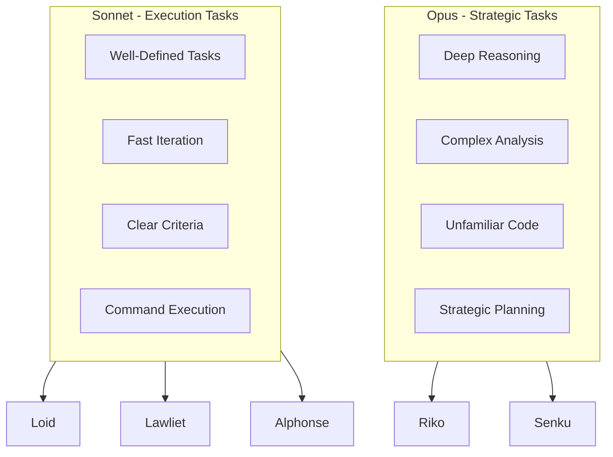

# Agent Specialization

Understanding why Agent Flow uses multiple specialized agents instead of a single general-purpose agent, and how model selection optimizes for both quality and cost.

## The Case for Specialization

A single general-purpose agent attempting to handle exploration, planning, implementation, review, and verification faces several challenges:

1. **Context overload**: Trying to hold all skills in context dilutes focus
2. **Tool conflicts**: Having all tools available creates temptation to shortcut
3. **Role confusion**: Unclear when to plan vs. implement vs. verify
4. **No separation of concerns**: Self-review is inherently less rigorous

Agent Flow addresses these by creating focused specialists, each with:
- A clear role and responsibility
- A restricted set of appropriate tools
- Specific behavioral guidelines
- An optimal model for their task type

## Agent Roles

### Riko - The Explorer

**Purpose**: Fast codebase exploration and information gathering

**Why specialized?**
- Exploration requires breadth-first thinking
- Read-only access prevents accidental modifications
- Web access enables external documentation lookup
- Focus on finding, not implementing

**Model**: Opus (deep reasoning for unfamiliar codebases)

**Tools**: Read, Grep, Glob, Bash (AST analysis only), WebSearch, WebFetch

**Key behaviors**:
- Three-tier search: local repository, web, user clarification
- Evidence-based findings with file paths and line numbers
- Never runs code or modifies files

### Senku - The Planner

**Purpose**: Strategic planning and implementation strategy

**Why specialized?**
- Planning requires foresight and risk assessment
- Separation from implementation prevents premature coding
- TodoWrite creates structured, trackable plans
- Focus on strategy, not execution

**Model**: Opus (strategic planning needs deep reasoning)

**Tools**: Read, Grep, Glob, TodoWrite

**Key behaviors**:
- Explores codebase to understand existing patterns
- Creates step-by-step implementation plans
- Identifies risks and edge cases
- Never writes code directly

### Loid - The Executor

**Purpose**: Code implementation following plans

**Why specialized?**
- Implementation benefits from focused execution
- Having Write/Edit tools concentrated in one agent
- Quick sanity tests catch immediate issues
- Clear handoff points to verification

**Model**: Sonnet (fast execution with sufficient capability)

**Tools**: Read, Write, Edit, Bash, Grep, Glob

**Key behaviors**:
- Follows plans precisely
- Makes changes incrementally
- Runs tests after each change
- Reports blockers immediately

### Lawliet - The Reviewer

**Purpose**: Code quality assurance through static analysis

**Why specialized?**
- Review requires independent perspective
- Separation from implementation enables objectivity
- Static analysis focus (no test execution)
- Clear verdict for proceed/iterate decision

**Model**: Sonnet (fast iteration for review cycles)

**Tools**: Read, Grep, Glob, Bash (static analysis only)

**Key behaviors**:
- Reviews all modified files
- Runs type checking and linting
- Checks security concerns
- Provides actionable feedback

### Alphonse - The Verifier

**Purpose**: Comprehensive verification through test execution

**Why specialized?**
- Verification is the final quality gate
- Separation from implementation prevents bias
- Focus on running commands and reporting results
- Clear pass/fail determination

**Model**: Sonnet (quick command execution)

**Tools**: Bash, Read, Grep

**Key behaviors**:
- Runs full test suite
- Verifies types, lint, build
- Reports exact command output
- Never modifies code

## Model Selection Strategy

Agent Flow uses two model tiers optimized for different task types:



### When Opus Excels

**Deep reasoning required**:
- Exploring unfamiliar codebases
- Understanding complex architectures
- Making strategic decisions
- Analyzing ambiguous requirements

**Cost justified by**:
- Reduced iterations from better understanding
- Fewer mistakes in planning
- More thorough exploration

### When Sonnet Excels

**Fast execution required**:
- Implementing well-defined plans
- Running verification commands
- Iterating on review feedback
- Executing repetitive operations

**Cost optimized by**:
- Speed for iteration cycles
- Sufficient capability for clear tasks
- Lower cost per operation

### Model Assignment Rationale

| Agent | Model | Rationale |
|-------|-------|-----------|
| Riko | Opus | Exploration of unfamiliar code needs thorough analysis |
| Senku | Opus | Strategic planning requires deep reasoning for task decomposition |
| Loid | Sonnet | Implementation benefits from speed with sufficient capability |
| Lawliet | Sonnet | Review cycles need fast iteration for feedback loops |
| Alphonse | Sonnet | Verification is command-focused with clear pass/fail criteria |

## Tool Access Matrix

Each agent has a restricted toolset matching their responsibilities:

```
Agent           Read  Grep  Glob  Write Edit  Bash  Web   Todo
-----------     ----  ----  ----  ----- ----  ----  ---   ----
Riko            Yes   Yes   Yes   -     -     Yes*  Yes   -
Senku           Yes   Yes   Yes   -     -     -     -     Yes
Loid            Yes   Yes   Yes   Yes   Yes   Yes   -     -
Lawliet         Yes   Yes   Yes   -     -     Yes** -     -
Alphonse        Yes   Yes   -     -     -     Yes   -     -

* Riko's Bash is restricted to AST analysis tools only (ast-grep, tree-sitter, language parsers)
** Lawliet's Bash is restricted to static analysis tools
```

### Key Restrictions

1. **Only Loid can modify files** (Write, Edit)
   - Prevents accidental changes during exploration
   - Ensures implementation follows plans
   - Creates clear audit trail

2. **Only Riko can access the web** (WebSearch, WebFetch)
   - Focuses web usage on research
   - Prevents implementation shortcuts
   - Maintains codebase focus

3. **Only Senku can manage tasks** (TodoWrite)
   - Centralizes planning authority
   - Creates structured implementation paths
   - Prevents ad-hoc task creation

## Specialization Benefits

### Clear Responsibility

Each agent knows exactly what they should and should not do:

```
Riko:    "I find things. I don't change things."
Senku:   "I plan things. I don't implement things."
Loid:    "I implement things. I don't plan things."
Lawliet: "I review things. I don't fix things."
Alphonse: "I verify things. I don't modify things."
```

### Separation of Concerns

The agent pipeline creates natural checkpoints:

```
Exploration -> Planning -> Implementation -> Review -> Verification
    |             |             |              |            |
  Context      Strategy       Code         Quality      Evidence
  gathering    design        changes      assurance    confirmation
```

### Independent Verification

Because verification agents didn't write the code:
- No bias toward "my code works"
- Fresh perspective on quality
- Objective pass/fail determination

## Extending with New Agents

When adding new agents, consider:

1. **What is their specific responsibility?**
   - Single, focused purpose
   - Clear boundaries with existing agents

2. **What tools do they need?**
   - Minimum necessary for their role
   - Avoid overlapping capabilities

3. **Which model tier?**
   - Strategic/planning tasks -> Opus
   - Execution/verification tasks -> Sonnet

4. **How do they fit the workflow?**
   - Which phase do they participate in?
   - What handoffs do they receive/provide?

See [Adding Agents Guide](../guides/adding-agents.md) for implementation details.

## Related Concepts

- [The "Subagents LIE" Principle](subagents-lie.md) - Why verification is separate
- [Evidence-Based Verification](evidence-based-verification.md) - What constitutes proof
- [Architecture Overview](../architecture/overview.md) - System design
- [Agents Reference](../reference/agents.md) - Complete specifications
