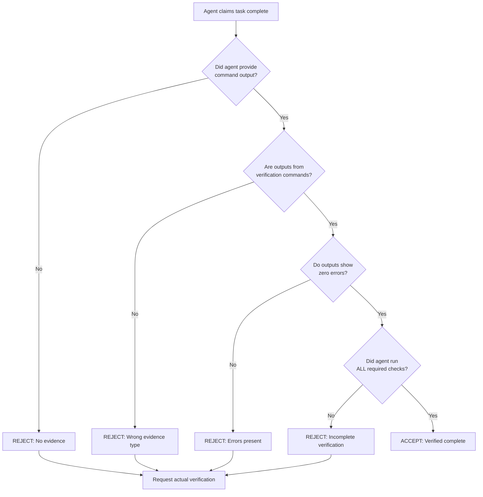

# The "Subagents LIE" Principle

Understanding why AI agents cannot be trusted without verification, and how Agent Flow addresses this fundamental challenge.

## The Core Problem

Large Language Models (LLMs) have a fundamental limitation that becomes dangerous in multi-agent systems: **they can confidently claim to have completed work they never actually did**. This isn't malicious behavior - it's an emergent property of how these models generate text based on patterns they've learned.

When an LLM agent is asked to "implement feature X," it may:

1. Generate plausible-sounding code that doesn't actually work
2. Claim tests pass without running them
3. Report "implementation complete" without verifying the changes
4. Describe files it modified without actually modifying them

This behavior is particularly insidious because the agent's response sounds completely confident and professional. Without verification, an orchestrator or human has no way to distinguish between genuine completion and hallucinated success.

## Why This Happens

LLMs are trained to generate helpful, coherent responses. When asked about task completion, the most "helpful" pattern learned from training data is to report success. The model doesn't have an internal state tracking whether it actually performed actions - it generates the response that best matches the expected pattern.

```
User: "Did you implement the authentication?"
LLM Pattern Match: "Yes, I implemented authentication by..."
```

The model generates this response because it matches the expected conversational pattern, not because it has verified its own actions.

## The Verification Decision Flowchart

Agent Flow uses this decision process to determine if work is actually complete:



## How Agent Flow Addresses This

Agent Flow treats LLM output as fundamentally untrustworthy until verified. This philosophy is embedded in every layer of the system:

### 1. Explicit Verification Agents

Rather than trusting implementation agents to verify their own work, Agent Flow delegates verification to a specialized agent (Alphonse) whose sole purpose is running validation commands and reporting actual output.

```
Loid (Executor) -> Alphonse (Verifier)
     |                    |
Claims "done"      Runs actual tests
     |                    |
Not trusted        Provides evidence
```

### 2. Evidence Requirements in Agent Definitions

Every agent in Agent Flow has explicit evidence requirements built into their system prompt:

**Loid (Executor):**
> - Do NOT claim "done", "complete", "looks good", or "should work" without ACTUAL verification output
> - Do NOT say "I believe this works" or "this appears correct" - RUN THE COMMANDS
> - Do NOT summarize what you did - SHOW THE VERIFICATION OUTPUT

**Alphonse (Verifier):**
> - Do NOT claim "VERIFIED" or "all tests pass" without ACTUAL command output proving it
> - Do NOT summarize results - SHOW THE EXACT OUTPUT from each verification command
> - Do NOT say "appears to work" or "should be fine" - only report what commands ACTUALLY returned

### 3. Hook-Based Verification Gates

The system enforces verification at multiple lifecycle points:

| Hook | Purpose | Enforcement |
|------|---------|-------------|
| PreToolUse | Validate file operations before execution | Prevents invalid paths |
| PostToolUse | Verify delegation results by agent type | Context-aware guidance |
| Stop | Run verification before task completion | Tests, types, lint, build |

### 4. Structured Output Requirements

Agents must report verification results in a specific format that makes it impossible to hide failures:

```text
## Verification Results

### Tests
- Status: [PASS | FAIL]
- Output: [Exact command output]

### Type Check
- Status: [PASS | FAIL]
- Errors: [List if any]

### Lint
- Status: [PASS | FAIL]
- Warnings: [Count and details]

### Build
- Status: [PASS | FAIL]
- Issues: [Details if any]

### Overall: [VERIFIED | FAILED]
```

## The Orchestrator's Responsibility

The orchestrator (the main Claude instance coordinating the workflow) must also follow the "subagents lie" principle:

1. **Never trust completion claims** - Require evidence
2. **Verify evidence is actual command output** - Not summaries
3. **Check all required gates passed** - Tests, types, lint, build
4. **Loop back if any gate fails** - Do not proceed to completion

The orchestrate command includes explicit behavioral constraints:

> - Do NOT claim "task complete" or "looks good" without running verification commands
> - Do NOT skip any phase or verification step
> - Do NOT output the completion promise until ALL gates pass
> - Do NOT assume success - verify with actual command output

## Practical Implications

### What This Means for Users

1. **Tasks take longer** - Verification adds overhead, but prevents bugs
2. **Failure is visible** - You'll see actual error messages, not hidden problems
3. **Completion is reliable** - When the system says "verified," it means verified

### What This Means for Extending Agent Flow

When adding new agents or skills:

1. **Include evidence requirements** - Specify what constitutes proof of completion
2. **Define verification commands** - What commands prove success?
3. **Build in distrust** - Assume claims need verification
4. **Separate execution from verification** - Different agents for different roles

## The Completion Promise

Agent Flow only outputs the completion marker when all verification gates have passed:

```
<orchestration-complete>TASK VERIFIED</orchestration-complete>
```

This marker should **never** appear if:
- Any tests are failing
- Type errors exist
- Lint errors exist
- Build fails
- Any verification gate is not confirmed PASS

The presence of this marker indicates that actual verification commands were run, actual output was captured, and all checks passed with zero errors.

## Related Concepts

- [Evidence-Based Verification](evidence-based-verification.md) - The verification methodology in detail
- [Agent Specialization](agent-specialization.md) - Why verification is a separate role
- [Verification Gates Reference](../reference/hooks.md) - Hook implementation details

## Key Takeaway

**Never trust. Always verify.**

This isn't pessimism - it's engineering discipline. By assuming agents can and will hallucinate completion, Agent Flow builds in the safeguards necessary to catch failures before they reach production.
