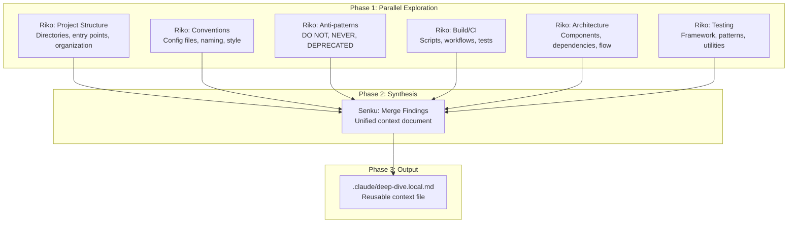

# Using Deep-Dive

A practical guide to gathering comprehensive codebase context with the `/deep-dive` command.

## What is Deep-Dive?

Deep-dive is a parallel exploration workflow that creates reusable codebase context. Instead of exploring during each task, you can run deep-dive once and leverage that context for multiple subsequent orchestrations.

## When to Use Deep-Dive

### Good Use Cases

- **Starting on an unfamiliar codebase**: Build understanding before making changes
- **Beginning a new development session**: Refresh your context efficiently
- **Before complex refactoring**: Ensure you understand all affected areas
- **Team onboarding**: Create shareable context documentation

### When to Skip

- **Simple, isolated changes**: Overhead not justified
- **Very familiar codebase**: You already know the patterns
- **Urgent fixes**: Direct orchestration may be faster

## Basic Usage

### Full Exploration

Explore the entire codebase:

```
/deep-dive
```

This fires 5+ parallel Riko agents, each exploring a different aspect:
- Project structure and organization
- Coding conventions and patterns
- Anti-patterns and warnings
- Build system and CI
- Architecture and dependencies
- Testing patterns

### Focused Exploration

Concentrate on a specific area:

```
/deep-dive --focus=src/auth
```

Useful when:
- Working on a specific module
- Investigating a particular feature
- Preparing for targeted refactoring

### Refreshing Context

Update existing deep-dive context:

```
/deep-dive --refresh
```

Use after:
- Major codebase changes
- Extended time away from the project
- Context feels outdated

## The Deep-Dive Workflow



### Phase 1: Parallel Exploration

All agents fire simultaneously, not sequentially. Each explores independently:

| Agent Focus | What It Finds |
|-------------|---------------|
| Structure | Directory layout, monorepo detection, entry points |
| Conventions | ESLint, Prettier, TypeScript configs, style guides |
| Anti-patterns | Comments with DO NOT, NEVER, DEPRECATED, TODO |
| Build/CI | npm scripts, GitHub Actions, test framework |
| Architecture | Core modules, service patterns, data flow |
| Testing | Test directories, fixtures, mocks, utilities |

### Phase 2: Synthesis

Senku merges all findings into a coherent document:
- Resolves conflicts between agent findings
- Organizes information by usefulness
- Creates quick-reference tables
- Adds context for downstream agents

### Phase 3: Output

The result is saved to `.claude/deep-dive.local.md`:
- YAML frontmatter with metadata
- Markdown content with context
- Structured for both human and agent consumption

## Output Structure

### Example deep-dive.local.md

```markdown
---
generated: 2024-01-15T10:00:00Z
scope: full
focus_path: null
phase: complete
---

# Deep-Dive Context

## Repository Overview
- **Tech stack**: TypeScript, React, Node.js, PostgreSQL
- **Entry points**: src/index.ts, src/server.ts
- **Key patterns**: Repository pattern, Dependency injection

## Architecture Map
| Component | Location | Purpose |
|-----------|----------|---------|
| API Layer | src/api/ | REST endpoints |
| Services | src/services/ | Business logic |
| Models | src/models/ | Data structures |

## Conventions
- **Naming**: camelCase functions, PascalCase classes
- **Testing**: Jest with __tests__ directories
- **Error handling**: Custom AppError class

## Anti-Patterns (DO NOT)
- Do not use `any` type
- Do not import from `src/internal/`
- Do not modify global state

## Key Files Quick Reference
| Task | Look Here |
|------|-----------|
| Add API endpoint | src/api/routes/ |
| Add database model | src/models/ |
| Add service | src/services/ |

## Agent Notes
- Authentication uses JWT with refresh tokens
- Database uses Prisma ORM
- Tests require running database
```

## Using Deep-Dive with Orchestrate

The primary value of deep-dive is accelerating subsequent orchestrations:

```bash
# First: gather context
/deep-dive

# Then: use context for tasks
/orchestrate --use-deep-dive Add user authentication
/orchestrate --use-deep-dive Fix the login bug
/orchestrate --use-deep-dive Refactor the user service
```

### How --use-deep-dive Works

When you use `--use-deep-dive`:

1. **Phase 1 (Exploration) is accelerated**:
   - Deep-dive context is loaded
   - Riko performs targeted exploration only
   - Skips redundant architecture discovery

2. **Context is injected into agents**:
   - Patterns and conventions are known
   - Anti-patterns are avoided
   - File locations are pre-mapped

3. **Less exploration, more execution**:
   - Faster time to implementation
   - More consistent with codebase patterns

## Dynamic Agent Scaling

Deep-dive automatically scales based on project complexity:

| Factor | Threshold | Additional Agents |
|--------|-----------|-------------------|
| Total files | >100 | +1 per 100 files |
| Directory depth | >= 4 | +2 for deep exploration |
| Monorepo | detected | +1 per package |
| Multiple languages | >1 | +1 per language |

For large projects, you might see 8-12 parallel agents instead of 6.

## Best Practices

### 1. Run Deep-Dive Early

Before starting significant work on a codebase:

```
/deep-dive
```

The upfront investment pays off across multiple tasks.

### 2. Use Focused Mode for Large Codebases

For very large projects, focus on relevant areas:

```
/deep-dive --focus=packages/auth
```

Better context for the specific area you're working on.

### 3. Refresh After Major Changes

After significant refactoring or new features:

```
/deep-dive --refresh
```

Keep context aligned with reality.

### 4. Check Context Before Using

Verify deep-dive is complete:

```bash
grep '^phase:' .claude/deep-dive.local.md
# Should show: phase: complete
```

### 5. Don't Over-Rely on Stale Context

If deep-dive was generated long ago:
- Consider refreshing
- Or run orchestration without `--use-deep-dive`

## Monitoring Progress

### Check Current Phase

```bash
grep '^phase:' .claude/deep-dive.local.md
```

### View Generation Time

```bash
grep '^generated:' .claude/deep-dive.local.md
```

### Check Scope

```bash
grep '^scope:' .claude/deep-dive.local.md
```

## Troubleshooting

### Deep-Dive Takes Too Long

For very large codebases:
- Use `--focus=<path>` to limit scope
- Consider splitting exploration by area

### Context Seems Incomplete

If important areas are missing:
- Check if focus path was too narrow
- Run `--refresh` to regenerate
- Consider multiple focused deep-dives

### Orchestration Ignores Context

Verify:
1. Deep-dive phase is "complete"
2. Using `--use-deep-dive` flag
3. Context file exists at `.claude/deep-dive.local.md`

## Example Session

```
# Start with deep-dive
User: /deep-dive

[System initializes state]
[5+ Riko agents fire in parallel]
[Senku synthesizes findings]
[Context saved to .claude/deep-dive.local.md]

Claude: Deep-dive complete. Context saved.
        Use: /orchestrate --use-deep-dive <task>

# Now use the context
User: /orchestrate --use-deep-dive Add password reset functionality

[Exploration phase uses existing context]
[Targeted exploration for password-specific files]
[Planning, implementation, review, verification...]

Claude: Task verified. Password reset implemented.
```

## Related Documentation

- [Using Orchestrate](using-orchestrate.md) - Execute complex tasks
- [Commands Reference](../reference/commands.md) - Command specifications
- [State Files Reference](../reference/state-files.md) - State file formats
