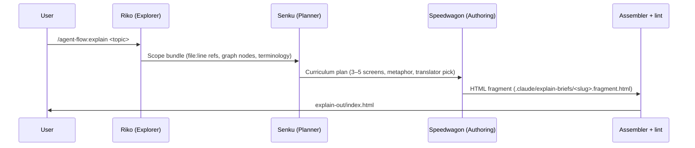

# Using Explain

A practical guide to generating interactive HTML explainers for codebase topics with the `/agent-flow:explain` command.

## What is Explain?

Explain is a teaching pipeline that transforms a codebase topic into a self-contained, interactive HTML file your team can open directly in a browser. Instead of writing documentation by hand, you describe what you want explained and four agents collaborate to produce a polished result: Riko gathers the relevant code scope, Senku designs a 3–5 screen teaching arc, Speedwagon authors the HTML, and the assembler concatenates everything into `explain-out/index.html`.

The output includes scroll-based navigation between screens, code↔English side-by-side translators, embedded quizzes, glossary tooltips, and Mermaid diagrams — all from a single command.

## When to Use Explain

### Good Use Cases

- **Onboarding a new team member** to a specific subsystem — give them an interactive explainer instead of a wall of docs
- **Documenting a complex concept** for future reference — the explainer captures both the code and the teaching arc
- **Teaching yourself** a part of the codebase you haven't touched — let the agents surface and explain it
- **Creating shareable educational material** — the output is a single self-contained HTML file, easy to distribute

### When to Skip

- **Simple, well-documented code** — existing inline comments may be sufficient
- **No deep-dive context** — `/explain` requires `.claude/deep-dive.local.md`; if you haven't run `/deep-dive`, the command will error early with a clear message
- **Sensitive or proprietary topics** — the output file is not committed (gitignored), but consider who can open the browser file

## Prerequisites

Before running `/agent-flow:explain`:

1. **Run `/deep-dive` first.** The command reads `.claude/deep-dive.local.md` at startup. If the file is absent it exits with:

   ```
   Error: .claude/deep-dive.local.md not found.
   Run /deep-dive first to build the codebase context.
   ```

2. **Graphify is optional.** If `graphify-out/graph.json` exists, Riko uses it for structural queries. If absent, the command continues in degraded mode — you will see a note, not an error.

## Basic Usage

### Normal Mode

Explain any topic as a natural-language phrase:

```
/agent-flow:explain how does orchestration work
/agent-flow:explain JWT authentication middleware
/agent-flow:explain the planning phase in agent-flow
```

The topic string is converted into a slug automatically:

```bash
# "how does orchestration work" → "how-does-orchestration-work"
```

### Revise Mode

Improve an existing explainer without redoing the scope and curriculum phases:

```
/agent-flow:explain --revise orchestration-pipeline
```

Speedwagon re-reads the existing brief at `.claude/explain-briefs/<slug>.md`, checks `explain-out/status.json` for revision notes, applies improvements, rewrites the HTML fragment, and re-runs the assembler.

## The Explain Workflow



### Phase 1: Scope (Riko)

Riko reads `.claude/deep-dive.local.md` for architecture context, queries the graphify graph if available, and returns a structured scope bundle containing:

- 3–8 `file:line` references directly relevant to the topic (concrete functions, types, or config values — not just filenames)
- 2–4 graph node names (or `graph: unavailable` if the graph is absent)
- 3–6 key terminology terms specific to the topic

### Phase 2: Curriculum (Senku)

Senku designs a 3–5 screen teaching arc from the scope bundle. Output includes:

- A one-sentence metaphor for the topic
- Screen titles, body text, and a translator pick (a specific `file:line` snippet to show in the code↔English pane)

### Phase 3: Authoring (Speedwagon)

Speedwagon reads every `file:line` reference to verify content exists before embedding it. It then:

1. Writes the module brief to `.claude/explain-briefs/<slug>.md`
2. Writes the HTML fragment to `.claude/explain-briefs/<slug>.fragment.html` using only the primitives defined in the allowed class vocabulary
3. Runs `bash scripts/compile-explain.sh` to assemble the final file

The lint guardrail (`scripts/lib/explain-lint.py`) enforces eight rules on every compile, including forbidden classes, inline event handlers, undefined CSS classes/variables, and diagram-first ordering.

### Phase 4: Assembly

The assembler concatenates all fragments into `explain-out/index.html`. After it completes, the command prints:

```
explain-out/index.html is ready.
Open in browser: file://<absolute-path>/explain-out/index.html
```

## Output Structure

```
explain-out/
  index.html        rendered explainer — open directly in a browser
  status.json       per-module feedback state

.claude/explain-briefs/
  <slug>.md             module brief (YAML frontmatter + teaching arc)
  <slug>.fragment.html  filled-in HTML fragment
```

The `explain-out/` directory is gitignored — generated artifacts are never committed to version control.

The `index.html` is fully self-contained: it loads fonts and libraries from CDN at runtime and requires no local server.

## Revise Mode

Use revise mode when:

- You want to improve an existing explainer without a full re-run
- The scope and curriculum are correct but the HTML needs polish
- `explain-out/status.json` contains feedback notes on a specific slug

```
/agent-flow:explain --revise <slug>
```

Revise mode skips Phase 1 (Riko scope) and Phase 2 (Senku curriculum), jumping directly to Speedwagon. The brief at `.claude/explain-briefs/<slug>.md` must exist — the command errors if it does not.

## Best Practices

**Run deep-dive before explain.** The scope Riko gathers is only as good as the context in `deep-dive.local.md`. A fresh, complete deep-dive produces better file:line references.

**Use a descriptive topic string.** Prefer `how does the planner agent generate task lists` over just `planner`. The more specific the topic, the tighter the scope bundle Riko returns.

**Check the brief before revising.** Read `.claude/explain-briefs/<slug>.md` to understand what Senku planned. If the curriculum is off, a full re-run with a more specific topic string will produce better results than revise.

**Keep the graphify graph current.** If you have graphify configured, running `graphify` after significant code changes gives Riko better structural context.

**One topic per invocation.** The command produces one module per run. For multi-topic coverage, run `/agent-flow:explain` once per topic and open each `explain-out/index.html` in turn.

## Troubleshooting

### Missing deep-dive

**Symptom**: Command exits immediately with `Error: .claude/deep-dive.local.md not found.`

**Fix**: Run `/deep-dive` first, then retry.

### Lint failures

**Symptom**: Assembler exits with a non-zero code; lint errors appear in the output.

**Fix**: Read the lint error messages. Common causes include undefined CSS classes (Speedwagon used a class not in the allowed vocabulary), inline `onclick` handlers, or a Mermaid diagram placed after prose inside `.screen__body`. The brief at `.claude/explain-briefs/<slug>.md` remains intact — use revise mode to correct the fragment.

### Revise after manual edits

**Symptom**: You edited `explain-out/index.html` directly and want to preserve changes.

**Fix**: Do not edit `explain-out/index.html` directly — it is regenerated on every compile. Edit `.claude/explain-briefs/<slug>.fragment.html` instead, then run revise mode to reassemble.

### Graph unavailable

**Symptom**: Output includes `Note: graphify-out/graph.json not found. Continuing in degraded mode.`

**Fix**: This is not an error — the command continues without graph context. Install and run graphify if you want richer structural references in the scope bundle.

## Related Documentation

- [Using Deep-Dive](using-deep-dive.md) - Required prerequisite: gather codebase context
- [Commands Reference](../reference/commands.md#agent-flowexplain) - Full `/agent-flow:explain` specification
- [Agents Reference](../reference/agents.md) - Speedwagon agent specification
- [Skills Reference](../reference/skills.md) - explainer-design-system skill details
- [Using Graphify](using-graphify.md) - Optional: build the knowledge graph for better scope
