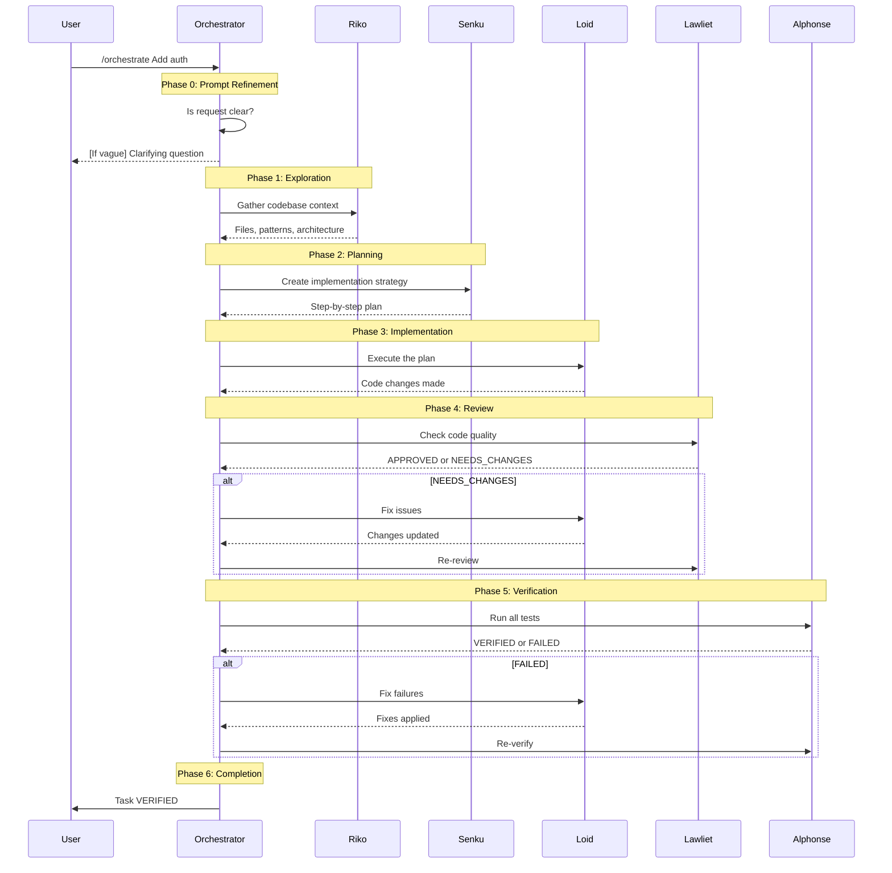

# Using Orchestrate

A practical guide to executing complex multi-step tasks with the `/orchestrate` command.

## What is Orchestrate?

Orchestrate is a multi-agent workflow that coordinates specialists to complete complex development tasks. Instead of a single agent attempting everything, orchestrate delegates to experts:

1. **Riko** explores the codebase
2. **Senku** creates an implementation plan
3. **Loid** implements the changes
4. **Lawliet** reviews code quality
5. **Alphonse** verifies everything passes

## When to Use Orchestrate

### Good Use Cases

- **New feature implementation**: Multiple files need changes
- **Bug fixes requiring investigation**: Root cause unknown
- **Refactoring**: Changes affect multiple components
- **Cross-cutting concerns**: Auth, logging, error handling

### When to Skip

- **Simple questions**: "How does X work?"
- **Single-file fixes**: Known location, clear solution
- **Exploration only**: Use `/deep-dive` instead

## Basic Usage

### Simple Orchestration

```
/orchestrate Add user authentication with JWT tokens
```

### With Deep-Dive Context

```
/orchestrate --use-deep-dive Add user profile page
```

Use `--use-deep-dive` when you've previously run `/deep-dive` to accelerate exploration.

## The Orchestration Workflow



## Phase Details

### Phase 0: Prompt Refinement

Before work begins, the system ensures your request is clear.

**If your request is vague:**
```
User: /orchestrate make the auth better

Claude: I'd like to clarify your request. What aspect of authentication
should I improve?

1. Add new auth method (OAuth, SSO, MFA)
2. Fix security vulnerabilities
3. Improve performance
4. Refactor for maintainability

Please specify, or I'll proceed with option 4 (refactoring).
```

**If your request is clear:**
```
User: /orchestrate Add OAuth2 login with Google provider

Claude: Task understood. Beginning orchestration...

**Goal**: Add OAuth2 authentication with Google
**Description**: Integrate Google OAuth2 provider for user login
**Actions**:
- Configure Google OAuth credentials
- Add OAuth routes and handlers
- Update user model for OAuth data
- Add frontend login button
```

### Phase 1: Exploration

Riko gathers context about your codebase.

**What Riko finds:**
- Relevant files and their locations
- Existing patterns and conventions
- Architecture and dependencies
- Similar implementations to follow

**Output example:**
```markdown
## Exploration Results

### Key Files
- `src/auth/login.ts:45-67` - Current login implementation
- `src/middleware/auth.ts:12-30` - Auth middleware
- `src/config/auth.ts:5-20` - Auth configuration

### Patterns Found
- **Auth pattern**: JWT-based with refresh tokens
- **Route pattern**: Express router in `src/routes/`
- **Config pattern**: Environment-based in `src/config/`

### Recommendations
- Add OAuth handler in `src/auth/oauth.ts`
- Extend config in `src/config/auth.ts`
- Add routes in `src/routes/auth.ts`
```

### Phase 2: Planning

Senku creates a detailed implementation strategy.

**What Senku produces:**
- Files to modify (with verification they exist)
- Step-by-step implementation plan
- Risks and mitigations
- Verification criteria

**Output example:**
```markdown
## Implementation Plan

### Files to Modify
| File | Changes |
|------|---------|
| src/config/auth.ts | Add OAuth config |
| src/auth/oauth.ts | New OAuth handler |
| src/routes/auth.ts | Add OAuth routes |
| src/types/user.ts | Extend user type |

### Implementation Steps
1. Add Google OAuth configuration
2. Create OAuth handler with token exchange
3. Add OAuth callback route
4. Update user model for OAuth data
5. Add tests for OAuth flow

### Risks
- **Token storage**: Mitigate with secure httpOnly cookies
- **State validation**: Implement CSRF protection
```

### Phase 3: Implementation

Loid executes the plan, making incremental changes.

**What Loid does:**
- Follows Senku's plan precisely
- Makes changes one file at a time
- Runs tests after each change
- Reports any blockers immediately

**Output example:**
```text
Implementing step 1: Add Google OAuth configuration

Modified: src/config/auth.ts
Added GOOGLE_CLIENT_ID, GOOGLE_CLIENT_SECRET configuration

Sanity check:
$ npx tsc --noEmit
(clean)

Implementing step 2: Create OAuth handler...
```

### Phase 4: Review

Lawliet checks code quality through static analysis.

**What Lawliet checks:**
- Type safety (tsc --noEmit, mypy)
- Code style (ESLint, Ruff)
- Security concerns (npm audit, bandit)
- Pattern adherence

**Possible outcomes:**

**APPROVED:**
```markdown
## Code Review

### Summary
OAuth implementation follows existing patterns and passes all checks.

### Verdict: APPROVED
```

**NEEDS_CHANGES:**
```markdown
## Code Review

### Issues Found
- **Major**: Missing input validation in `src/auth/oauth.ts:34`
- **Minor**: Inconsistent error handling in callback

### Verdict: NEEDS_CHANGES
```

When NEEDS_CHANGES, orchestration loops back to Loid.

### Phase 5: Verification

Alphonse runs comprehensive verification.

**What Alphonse runs:**
- Full test suite
- Type checking
- Linting
- Build verification

**Output example:**
```markdown
## Verification Results

### Tests
- Status: PASS
- Output: 47/47 tests passed

### Type Check
- Status: PASS
- Output: (clean)

### Lint
- Status: PASS
- Output: (clean)

### Build
- Status: PASS
- Output: Build successful

### Overall: VERIFIED
```

If any gate fails, orchestration loops back to Loid with specific errors.

### Phase 6: Completion

Only after ALL verification gates pass:

```
<orchestration-complete>TASK VERIFIED</orchestration-complete>

## Summary

### Implemented
- OAuth2 login with Google provider
- Secure token handling with httpOnly cookies
- CSRF protection for OAuth flow

### Files Modified
- src/config/auth.ts
- src/auth/oauth.ts (new)
- src/routes/auth.ts
- src/types/user.ts
- src/__tests__/oauth.test.ts (new)

### Verification
- Tests: 47/47 passed
- Types: Clean
- Lint: Clean
- Build: Successful
```

## State Tracking

Orchestration progress is tracked in `.claude/orchestration.local.md`:

```bash
# Check current phase
grep '^current_phase:' .claude/orchestration.local.md

# Check iteration count
grep '^iteration:' .claude/orchestration.local.md

# View full state
head -30 .claude/orchestration.local.md
```

## Handling Failures

### Review Failures

When Lawliet finds issues:
1. Specific issues are logged
2. Loid receives the feedback
3. Loid makes corrections
4. Lawliet re-reviews

### Verification Failures

When Alphonse finds failures:
1. Exact errors are captured
2. Loid receives the output
3. Loid fixes the issues
4. Alphonse re-verifies

### Maximum Iterations

To prevent infinite loops:
- Default max: 10 iterations
- Configurable via init script
- Task fails if max reached

## Best Practices

### 1. Be Specific in Your Request

**Good:**
```
/orchestrate Add password reset with email verification and 24-hour expiry
```

**Less Good:**
```
/orchestrate Add password reset
```

### 2. Use Deep-Dive for Unfamiliar Codebases

```bash
# First time on a codebase
/deep-dive

# Then orchestrate with context
/orchestrate --use-deep-dive Add feature
```

### 3. Let the System Ask Questions

Don't over-specify. If your request is ambiguous, the system will ask clarifying questions.

### 4. Trust the Verification

If orchestration says VERIFIED, the code:
- Passes all tests
- Has no type errors
- Has no lint errors
- Builds successfully

### 5. Review the Summary

Always read the completion summary:
- What was implemented
- Which files changed
- What verification confirmed

## Troubleshooting

### Orchestration Seems Stuck

Check the current phase:
```bash
grep '^current_phase:' .claude/orchestration.local.md
```

Check iteration count:
```bash
grep '^iteration:' .claude/orchestration.local.md
```

### Tests Keep Failing

The system will attempt to fix failures. If stuck:
- Review the exact error output
- Consider if the task scope is too large
- Break into smaller orchestrations

### Review Keeps Rejecting

If Lawliet repeatedly finds issues:
- Check if codebase has strict lint rules
- Review the specific complaints
- Consider adjusting the approach

## Example Session

```
User: /orchestrate Add rate limiting to the API endpoints

Claude: Beginning orchestration...

[Phase 0: Prompt Refinement]
Task is clear. Proceeding with rate limiting implementation.

[Phase 1: Exploration - Riko]
Found API routes in src/routes/
Found existing middleware pattern in src/middleware/
Found config pattern in src/config/

[Phase 2: Planning - Senku]
Plan created:
1. Add rate-limiter-flexible dependency
2. Create rate limit middleware
3. Apply to API routes
4. Add configuration options
5. Add tests

[Phase 3: Implementation - Loid]
Implementing changes...
Running sanity tests after each change...

[Phase 4: Review - Lawliet]
Static analysis passed.
Verdict: APPROVED

[Phase 5: Verification - Alphonse]
Tests: 52/52 passed
Types: Clean
Lint: Clean
Build: Successful
Overall: VERIFIED

<orchestration-complete>TASK VERIFIED</orchestration-complete>

Rate limiting has been added to all API endpoints.
Configuration available in src/config/rate-limit.ts
```

## Related Documentation

- [Using Deep-Dive](using-deep-dive.md) - Gather codebase context
- [Commands Reference](../reference/commands.md) - Command specifications
- [Agents Reference](../reference/agents.md) - Agent details
- [The "Subagents LIE" Principle](../concepts/subagents-lie.md) - Why verification matters
