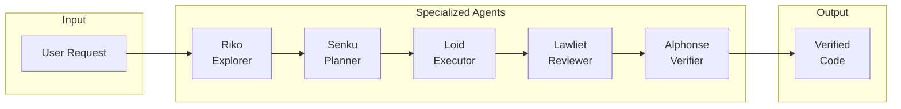

# Agent Flow Documentation

Transform Claude Code into a multi-agent orchestrated system with verification gates.

## Overview

Agent Flow is a Claude Code plugin that coordinates multiple specialized agents to complete complex development tasks. Instead of a single agent attempting everything, Agent Flow delegates to experts who work together through a verified pipeline.



## Key Features

| Feature | Description |
|---------|-------------|
| **Specialized Agents** | Five agents with distinct roles and tool access |
| **Verification Gates** | Mandatory testing, linting, and type checking |
| **Cost-Aware Models** | Opus for planning, Sonnet for execution |
| **Hook Automation** | Lifecycle events trigger validation |
| **Skill System** | Domain expertise modules guide behavior |

## Quick Links

### Getting Started

- [Installation](getting-started/installation.md) - Set up Agent Flow
- [Quick Start](getting-started/quick-start.md) - 5-minute introduction

### Core Concepts

- [The "Subagents LIE" Principle](concepts/subagents-lie.md) - Why verification matters
- [Agent Specialization](concepts/agent-specialization.md) - Why multiple agents
- [Evidence-Based Verification](concepts/evidence-based-verification.md) - What constitutes proof

### Guides

- [Using Orchestrate](guides/using-orchestrate.md) - Execute complex tasks
- [Using Deep-Dive](guides/using-deep-dive.md) - Gather codebase context
- [Adding Agents](guides/adding-agents.md) - Extend with new agents
- [Adding Skills](guides/adding-skills.md) - Create domain expertise

### Reference

- [Agents](reference/agents.md) - Agent specifications
- [Commands](reference/commands.md) - Command reference
- [Hooks](reference/hooks.md) - Hook system
- [Skills](reference/skills.md) - Skill system
- [State Files](reference/state-files.md) - State file formats

### Architecture

- [Overview](architecture/overview.md) - System design
- [Data Flows](architecture/data-flows.md) - Information flow diagrams
- [Design Decisions](architecture/design-decisions.md) - Why things work this way

## The Problem We Solve

LLMs can confidently claim task completion without actual verification. They generate responses based on patterns, not memories of actions taken. An agent might report "all tests pass" without ever running tests.

**Agent Flow solves this by:**

1. **Separating implementation from verification** - Different agents handle different concerns
2. **Requiring evidence, not claims** - Actual command output must be provided
3. **Automating quality gates** - Hooks enforce verification before completion
4. **Tracking state** - Progress is recorded and recoverable

## The Agents

| Agent | Model | Role | Key Capability |
|-------|-------|------|----------------|
| **Riko** | Opus | Explorer | Finds files, understands patterns |
| **Senku** | Opus | Planner | Creates implementation strategies |
| **Loid** | Sonnet | Executor | Writes and modifies code |
| **Lawliet** | Sonnet | Reviewer | Checks code quality |
| **Alphonse** | Sonnet | Verifier | Runs tests and validation |

Each agent has restricted tool access matching their role. Only Loid can modify files. Only Alphonse runs comprehensive tests.

## Example Workflow

```
User: /orchestrate Add user authentication with JWT tokens

[Riko explores the codebase]
Found: src/auth/, src/middleware/, src/routes/

[Senku creates a plan]
Plan: 1. Add JWT config, 2. Create auth middleware, 3. Add routes...

[Loid implements the plan]
Modified: src/auth/jwt.ts, src/middleware/auth.ts, src/routes/auth.ts

[Lawliet reviews the code]
Verdict: APPROVED (types clean, patterns followed)

[Alphonse verifies everything]
Tests: 47/47 passed | Types: clean | Lint: clean | Build: success

<orchestration-complete>TASK VERIFIED</orchestration-complete>
```

## Getting Started

### 1. Install

```bash
git clone https://github.com/your-org/agent-flow.git ~/agent-flow
```

### 2. Launch

```bash
claude --plugin-dir ~/agent-flow
```

### 3. Use

```
/orchestrate Add input validation to the user form
```

For detailed instructions, see [Installation](getting-started/installation.md) and [Quick Start](getting-started/quick-start.md).

## Design Principles

### Never Trust, Always Verify

Every claim from an agent must be backed by actual evidence. "Tests pass" is not acceptable - show the test output.

### Specialized Over General

Five focused agents outperform one general agent. Each knows their role and stays within boundaries.

### Cost-Aware Model Selection

Opus for strategic thinking (exploration, planning). Sonnet for execution (implementation, verification).

### Automated Quality Gates

Hooks enforce verification at lifecycle events. You can't claim completion without passing gates.

## Contributing

Agent Flow is extensible. You can:

- **Add agents** for new specialized roles
- **Add skills** for domain expertise
- **Add hooks** for lifecycle automation
- **Add commands** for new workflows

See the extension guides for details.

## Support

- Documentation: You're reading it
- Issues: GitHub Issues
- Source: GitHub Repository

---

**Version**: 1.0.0
**License**: MIT
