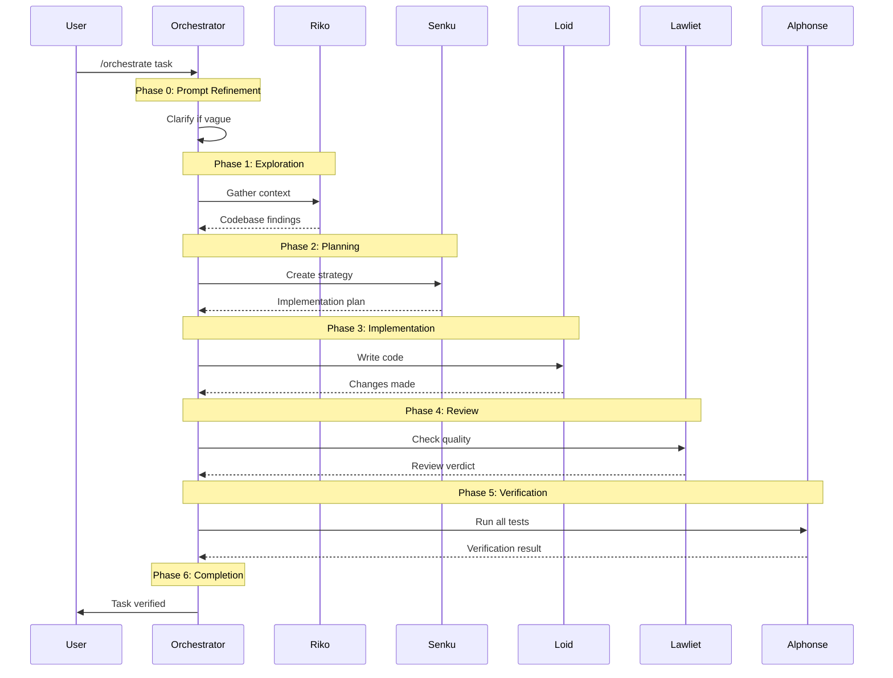
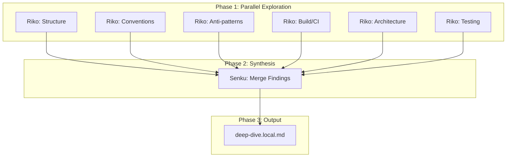

# Commands Reference

Complete reference for Agent Flow commands, including arguments, workflows, and integration patterns.

## Overview

Agent Flow provides two primary commands for multi-agent workflows:

| Command | Purpose | Primary Use Case |
|---------|---------|------------------|
| `/orchestrate` | Execute complex tasks through agent pipeline | Feature implementation, refactoring |
| `/deep-dive` | Gather comprehensive codebase context | New project onboarding, exploration |

## /orchestrate

Coordinate complex multi-step tasks through the agent system.

### Syntax

```
/orchestrate [--use-deep-dive] <task description>
```

### Arguments

| Argument | Required | Description |
|----------|----------|-------------|
| `<task description>` | Yes | What you want to accomplish |
| `--use-deep-dive` | No | Use existing deep-dive context |

### Examples

```bash
# Basic orchestration
/orchestrate Add user authentication with JWT tokens

# Using existing deep-dive context
/orchestrate --use-deep-dive Add user profile page

# Complex refactoring
/orchestrate Refactor the database layer to use connection pooling
```

### Workflow Phases

The orchestrate command follows a six-phase workflow:



### Phase Details

#### Phase 0: Prompt Refinement

Before beginning orchestration, the system ensures the task is well-defined:

1. **Check clarity**: Does the request specify what, where, and why?
2. **If vague**: Ask ONE clarifying question with options
3. **If clear**: Transform to structured format:
   - **Goal**: One-sentence outcome
   - **Description**: What and why (2-3 sentences)
   - **Actions**: Concrete steps

#### Phase 1: Exploration

**Agent**: Riko (Explorer)
**Purpose**: Gather codebase context

**Standard flow:**
- Find relevant files and patterns
- Understand existing architecture
- Identify key areas to modify

**With `--use-deep-dive`:**
- Read existing deep-dive context
- Perform targeted exploration only
- Skip redundant architecture discovery

#### Phase 2: Planning

**Agent**: Senku (Planner)
**Purpose**: Create implementation strategy

**Output:**
- Files to modify
- Step-by-step implementation plan
- Risks and edge cases
- Verification criteria

#### Phase 3: Implementation

**Agent**: Loid (Executor)
**Purpose**: Write code changes

**Process:**
- Follow Senku's plan precisely
- Make changes incrementally
- Run sanity tests after each change
- Report any blockers immediately

#### Phase 4: Review

**Agent**: Lawliet (Reviewer)
**Purpose**: Check code quality

**Checks:**
- Code correctness
- Security issues (via static analysis)
- Pattern adherence
- Potential bugs

**Outcomes:**
- APPROVED: Proceed to verification
- NEEDS_CHANGES: Return to implementation

#### Phase 5: Verification

**Agent**: Alphonse (Verifier)
**Purpose**: Run all verification gates

**Required checks:**
- Full test suite
- Type checking
- Linting
- Build verification

**Outcomes:**
- ALL PASS: Proceed to completion
- ANY FAIL: Return to implementation

#### Phase 6: Completion

Only after all verification gates pass:

```
<orchestration-complete>TASK VERIFIED</orchestration-complete>
```

### State Tracking

Orchestration progress is tracked in `.claude/orchestration.local.md`:

```yaml
---
active: true
current_phase: "implementation"
iteration: 1
max_iterations: 10
started_at: "2024-01-15T10:30:00Z"
task: "Add user authentication"
gates:
  exploration:
    status: "passed"
    timestamp: "2024-01-15T10:31:00Z"
  planning:
    status: "passed"
    timestamp: "2024-01-15T10:35:00Z"
  implementation:
    status: "in_progress"
  review:
    status: "pending"
  verification:
    status: "pending"
---
```

### Iteration Handling

If a phase fails:

1. Log the failure in state
2. Return to implementation with specific issues
3. Increment iteration count
4. Re-run failed phase
5. Continue only when gate passes

Maximum iterations prevent infinite loops.

---

## /deep-dive

Gather comprehensive codebase context using parallel exploration agents.

### Syntax

```
/deep-dive [--full | --focus=<path> | --refresh]
```

### Arguments

| Argument | Default | Description |
|----------|---------|-------------|
| `--full` | Yes | Full codebase exploration |
| `--focus=<path>` | No | Focus on specific directory |
| `--refresh` | No | Refresh existing context |

### Examples

```bash
# Full codebase exploration
/deep-dive

# Focus on specific area
/deep-dive --focus=src/auth

# Refresh existing context
/deep-dive --refresh
```

### Workflow



### Exploration Aspects

Each Riko agent explores a different aspect:

| Aspect | Focus Areas |
|--------|-------------|
| Structure | Directory layout, entry points, monorepo detection |
| Conventions | Config files, naming patterns, style guides |
| Anti-patterns | DO NOT patterns, deprecated code, warnings |
| Build/CI | Package scripts, CI configs, test framework |
| Architecture | Core modules, dependencies, data flow |
| Testing | Test directories, patterns, utilities |

### Dynamic Scaling

Additional agents spawn based on project size:

| Factor | Threshold | Additional Agents |
|--------|-----------|-------------------|
| Total files | >100 | +1 per 100 files |
| Directory depth | >= 4 | +2 for deep exploration |
| Monorepo | detected | +1 per package |
| Multiple languages | >1 | +1 per language |

### Output Format

The deep-dive creates `.claude/deep-dive.local.md`:

```markdown
---
generated: 2024-01-15T10:00:00Z
scope: full
focus_path: null
phase: complete
---

# Deep-Dive Context

## Repository Overview
- Tech stack: TypeScript, React, Node.js
- Entry points: src/index.ts, src/server.ts
- Key patterns: Repository pattern, Dependency injection

## Architecture Map
| Component | Location | Purpose |
|-----------|----------|---------|
| API Layer | src/api/ | REST endpoints |
| Services | src/services/ | Business logic |
| Models | src/models/ | Data structures |

## Conventions
- Naming: camelCase for functions, PascalCase for classes
- Testing: Jest with __tests__ directories
- Error handling: Custom AppError class

## Anti-Patterns (DO NOT)
- Do not use `any` type
- Do not import from `src/internal/`
- Do not modify global state

## Key Files Quick Reference
| Task | Look Here |
|------|-----------|
| Add API endpoint | src/api/routes/ |
| Add database model | src/models/ |
| Add service | src/services/ |

## Agent Notes
- Authentication uses JWT with refresh tokens
- Database uses Prisma ORM
- Tests require running database
```

### Integration with /orchestrate

After deep-dive completes:

```bash
/orchestrate --use-deep-dive Add user authentication
```

This injects deep-dive context into Phase 1, allowing targeted exploration instead of full discovery.

---

## State Files

Both commands use state files in `.claude/`:

| File | Command | Purpose |
|------|---------|---------|
| `orchestration.local.md` | /orchestrate | Track phase progress |
| `deep-dive.local.md` | /deep-dive | Store codebase context |

See [State Files Reference](state-files.md) for format details.

## Command Comparison

| Aspect | /orchestrate | /deep-dive |
|--------|--------------|------------|
| Purpose | Execute tasks | Gather context |
| Duration | Varies by task | 5-15 minutes |
| Output | Modified files | Context file |
| Agents | All five | Riko + Senku |
| Verification | Full gates | None |
| Reusable | No | Yes |

## Best Practices

### When to Use /deep-dive

- Starting work on unfamiliar codebase
- Beginning a new development session
- Before complex refactoring
- When orchestration exploration seems slow

### When to Use /orchestrate

- Implementing new features
- Fixing bugs
- Refactoring code
- Any task requiring code changes

### Combining Commands

```bash
# First session: explore the codebase
/deep-dive

# Subsequent tasks: leverage context
/orchestrate --use-deep-dive Add feature A
/orchestrate --use-deep-dive Fix bug B
/orchestrate --use-deep-dive Refactor module C

# After major changes: refresh context
/deep-dive --refresh
```

## Related Documentation

- [Using Orchestrate Guide](../guides/using-orchestrate.md) - Step-by-step usage
- [Using Deep-Dive Guide](../guides/using-deep-dive.md) - Step-by-step usage
- [State Files Reference](state-files.md) - State file formats
- [Agents Reference](agents.md) - Agent specifications
