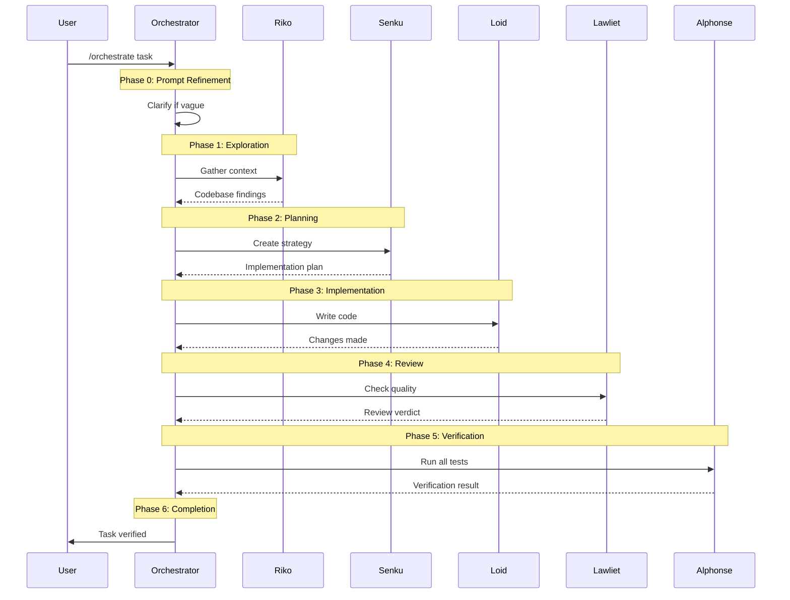
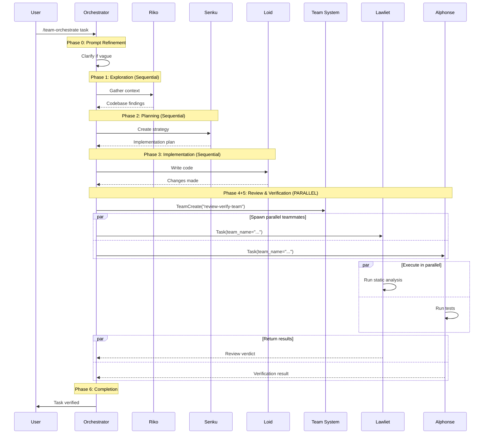
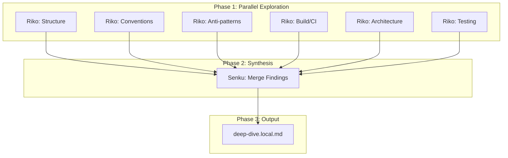
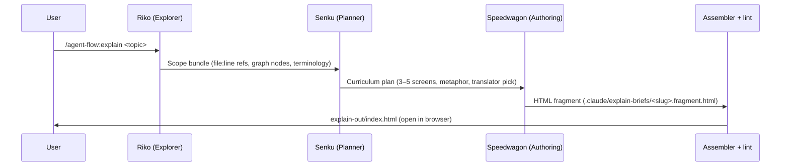

# Commands Reference

Complete reference for Agent Flow commands, including arguments, workflows, and integration patterns.

## Overview

Agent Flow provides five primary commands for multi-agent workflows:

| Command | Purpose | Primary Use Case |
|---------|---------|------------------|
| `/orchestrate` | Execute complex tasks through agent pipeline | Feature implementation, refactoring |
| `/team-orchestrate` | Execute tasks with parallel review/verification | Time-sensitive tasks, faster feedback |
| `/deep-dive` | Gather comprehensive codebase context | New project onboarding, exploration |
| `/agent-flow:analyze` | Surface subagent behaviour and improvement opportunities | Observability, retrospective analysis |
| `/agent-flow:explain` | Generate an interactive HTML explainer for any topic | Teaching a codebase concept to a new team member |

## /orchestrate

Coordinate complex multi-step tasks through the agent system.

### Syntax

```
/orchestrate [--use-deep-dive] <task description>
```

### Arguments

| Argument | Required | Description |
|----------|----------|-------------|
| `<task description>` | Yes | What you want to accomplish |
| `--use-deep-dive` | No | Use existing deep-dive context |

### Examples

```bash
# Basic orchestration
/orchestrate Add user authentication with JWT tokens

# Using existing deep-dive context
/orchestrate --use-deep-dive Add user profile page

# Complex refactoring
/orchestrate Refactor the database layer to use connection pooling
```

### Workflow Phases

The orchestrate command follows a six-phase workflow:


```mermaid
sequenceDiagram
    participant U as User
    participant O as Orchestrator
    participant R as Riko
    participant S as Senku
    participant L as Loid
    participant LW as Lawliet
    participant A as Alphonse

    U->>O: /orchestrate task

    Note over O: Phase 0: Prompt Refinement
    O->>O: Clarify if vague

    Note over O,R: Phase 1: Exploration
    O->>R: Gather context
    R-->>O: Codebase findings

    Note over O,S: Phase 2: Planning
    O->>S: Create strategy
    S-->>O: Implementation plan

    Note over O,L: Phase 3: Implementation
    O->>L: Write code
    L-->>O: Changes made

    Note over O,LW: Phase 4: Review
    O->>LW: Check quality
    LW-->>O: Review verdict

    Note over O,A: Phase 5: Verification
    O->>A: Run all tests
    A-->>O: Verification result

    Note over O: Phase 6: Completion
    O->>U: Task verified
```

## Delegation Decision Matrix

The orchestrator must route tool calls to persona owners:

| Tool(s) | Owner | Exception |
| --- | --- | --- |
| Read, Grep, Glob | Riko | single-line config read |
| Write, Edit | Loid | orchestration.local.md state updates |
| Bash (tests, build, lint) | Alphonse | — |
| Bash (static analysis) | Lawliet | — |
| TodoWrite, TaskCreate | Orchestrator / Senku | — |
| Agent dispatch | Orchestrator | — |

**Cache-read heuristic:** if a non-Bash tool call would read >200 lines or repeats a file already read in this phase, dispatch instead of inlining.

See the command files themselves for full matrix and anti-pattern examples.

### Phase Details

#### Phase 0: Prompt Refinement

Before beginning orchestration, the system ensures the task is well-defined:

1. **Check clarity**: Does the request specify what, where, and why?
2. **If vague**: Ask ONE clarifying question with options
3. **If clear**: Transform to structured format and capture:
   - **Goal**: One-sentence outcome
   - **Description**: What and why (2-3 sentences)
   - **Actions**: Concrete steps
   - **Constraints**: What must not be broken or changed
   - **Assumptions**: What is taken for granted
4. **Classify** `task_complexity` tier (`trivial`/`exploratory`/`implementation`/`complex`/`research`)
5. **Persist** the full intent to state via `--set-intent-*` / `--set-task-complexity` flags

#### Phase 1: Exploration

**Agent**: Riko (Explorer)
**Purpose**: Gather codebase context

**Standard flow:**
- Find relevant files and patterns
- Understand existing architecture
- Identify key areas to modify

**With `--use-deep-dive`:**
- Read existing deep-dive context
- Perform targeted exploration only
- Skip redundant architecture discovery

#### Phase 2: Planning

**Agent**: Senku (Planner)
**Purpose**: Create implementation strategy

**Output:**
- Files to modify
- Step-by-step implementation plan
- Risks and edge cases
- Verification criteria
- **Deliverable Output Contract** (target format / acceptance criteria / risk & edge cases) — required for any plan producing an artifact
- `<plan-interpretation>` block at the end of the plan (always emitted)

**Note:** Senku may be dispatched with an elevated thinking budget for complex architectural tasks where deep reasoning improves plan quality.

**Assumption Escalation Gate** (after Phase 2): The orchestrator scans Senku's reply for `<escalation type="assumption-contradicted">`. If present, the orchestrator calls `AskUserQuestion` and re-dispatches Senku. This gate runs *before* advancing state to Phase 3. Silent on happy path.

**Post-Plan Confirmation Gate** (between Phase 2 and 3, complex tasks only): For `task_complexity == "complex"` (case-insensitive), the orchestrator replays Senku's `<plan-interpretation>` together with the captured intent and prompts the user once to confirm or correct. If the task is not complex, this gate is skipped with an `info:` log entry.

#### Research Short-Circuit

**Trigger:** `task_complexity` is `research` or `exploratory`, OR `report_requested=true` in orchestration state (set during Phase 0 Prompt Refinement when the user explicitly requested a written report, investigation guide, or planning document).

**What happens:** Phases 3–5 (Implementation/Review/Verification) are skipped. The orchestrator runs `init-research-report.sh` and `compile-research-report.sh` directly (script-mediated write — see Delegation Decision Matrix), populating the report with findings from Riko (Phase 1) and Senku (Phase 2) synthesis.

**Artifact path:** `.claude/research-<slug>-<stamp>.local.md` — gitignored via `.claude/*.local.*`, durable across sessions.

**Completion tag variant:**
```
<research-report-complete>REPORT WRITTEN: .claude/research-<slug>-<stamp>.local.md</research-report-complete>
```
This replaces the `<orchestration-complete>` promise for research/exploratory paths.

See [State Files Reference](state-files.md#research-localmd) for the full frontmatter schema and body sections.

#### Phase 3: Implementation

**Agent**: Loid (Executor)
**Purpose**: Write code changes

**Process:**
- Follow Senku's plan precisely
- Make changes incrementally
- Run sanity tests after each change
- Report any blockers immediately

**Assumption Escalation Gate** (after Phase 3): The orchestrator scans Loid's reply for `<escalation type="assumption-contradicted">`. If present, the orchestrator calls `AskUserQuestion` and re-dispatches Loid. This gate runs *before* advancing state to Phase 4. Silent on happy path.

#### Phase 4: Review

**Agent**: Lawliet (Reviewer)
**Purpose**: Check code quality

**Checks:**
- Code correctness
- Security issues (via static analysis)
- Pattern adherence
- Potential bugs
- **Intent fidelity**: Flags `intent-mismatch` (Major → NEEDS_CHANGES) when a patch passes static analysis but does not satisfy the stated Goal/Constraints. This is separate from the complexipy cognitive-complexity check.

**Outcomes:**
- APPROVED: Proceed to verification
- NEEDS_CHANGES: Return to implementation (includes `intent-mismatch` findings)

**Codex co-review (optional):** When `codex.available` is `true` in orchestration state, the OpenAI Codex CLI runs as a co-reviewer alongside Lawliet via `scripts/dispatch-codex-review.sh`. If the Codex run fails, the review degrades to ADVISORY (Lawliet-only) with `codex_skip_reason` set to `timeout` or `error`. The final verdict follows the disagreement truth table in `commands/orchestrate.md` Phase 4; set `AGENT_FLOW_NO_CODEX=1` to disable for a run. See [Using Codex Co-Review](../guides/using-codex-review.md) for details.

#### Phase 5: Verification

**Agent**: Alphonse (Verifier)
**Purpose**: Run all verification gates

**Required checks:**
- Full test suite
- Type checking
- Linting
- Build verification

**Outcomes:**
- ALL PASS: Proceed to completion
- ANY FAIL: Return to implementation

#### Phase 6: Completion

Only after all verification gates pass:

```
<orchestration-complete>TASK VERIFIED</orchestration-complete>
```

**Intent Ledger** (printed before the completion promise):

```
## Intent Ledger

**Captured intent** (from state file):
- Goal: <intent.goal>
- Constraints: <intent.constraints or "none recorded">
- Key assumptions: <intent.assumptions or "none recorded">
- Task complexity: <task_complexity>

**Gap-handlers that fired this run:**
- Intent clarification (Gap 1): <"asked: <q>" | "not needed — task was clear">
- Interpretation/rationale confirm (Gaps 2/3): <"shown & confirmed" | "shown & corrected: <what>" | "skipped — task_complexity != complex">
- Lossless context pass-through (Gap 4): <"intent passed verbatim across phases" — always on>
- Behavioral guardrails (Gap 5): <"no plan deviations" | "deviations flagged: <what>">
- Assumption escalations (Gap 7): <"none" | one line per escalation: assumption → resolution>
- Intent-fidelity review (Gap 6): <"PASS" | "intent-mismatch flagged: <what>, resolved in iteration N">
```

### State Tracking

Orchestration progress is tracked in `.claude/orchestration.local.md`:

```yaml
---
active: true
current_phase: "implementation"
iteration: 1
max_iterations: 10
started_at: "2024-01-15T10:30:00Z"
task: "Add user authentication"
# task_complexity = task-classification tier (NOT complexipy code/cognitive complexity)
task_complexity: "complex"
intent:
  goal: "Add JWT-based user authentication"
  description: "Implement JWT auth with refresh tokens"
  actions: "1. Add config 2. Create middleware 3. Add routes"
  constraints: "Must not break existing session handling"
  assumptions: "Users table already exists"
gates:
  exploration:
    status: "passed"
    timestamp: "2024-01-15T10:31:00Z"
  planning:
    status: "passed"
    timestamp: "2024-01-15T10:35:00Z"
  implementation:
    status: "in_progress"
  review:
    status: "pending"
  verification:
    status: "pending"
---
```

### Iteration Handling

If a phase fails:

1. Log the failure in state
2. Return to implementation with specific issues
3. Increment iteration count
4. Re-run failed phase
5. Continue only when gate passes

Maximum iterations prevent infinite loops.

---

## /team-orchestrate

Coordinate complex multi-step tasks with PARALLEL execution of review and verification phases using Agent Teams.

### Syntax

```
/team-orchestrate [--use-deep-dive] [--force-sequential] <task description>
```

### Arguments

| Argument | Required | Description |
|----------|----------|-------------|
| `<task description>` | Yes | What you want to accomplish |
| `--use-deep-dive` | No | Use existing deep-dive context |
| `--force-sequential` | No | Force sequential mode even if Agent Teams available |

### Examples

```bash
# Basic team orchestration
/team-orchestrate Add user authentication with JWT tokens

# Using existing deep-dive context
/team-orchestrate --use-deep-dive Add user profile page

# Force sequential execution
/team-orchestrate --force-sequential Refactor the database layer

# Combine flags
/team-orchestrate --use-deep-dive --force-sequential Fix critical bug
```

### Workflow Phases

The team-orchestrate command follows a hybrid workflow with sequential and parallel phases:


```mermaid
sequenceDiagram
    participant U as User
    participant O as Orchestrator
    participant R as Riko
    participant S as Senku
    participant L as Loid
    participant T as Team System
    participant LW as Lawliet
    participant A as Alphonse

    U->>O: /team-orchestrate task

    Note over O: Phase 0: Prompt Refinement
    O->>O: Clarify if vague

    Note over O,R: Phase 1: Exploration (Sequential)
    O->>R: Gather context
    R-->>O: Codebase findings

    Note over O,S: Phase 2: Planning (Sequential)
    O->>S: Create strategy
    S-->>O: Implementation plan

    Note over O,L: Phase 3: Implementation (Sequential)
    O->>L: Write code
    L-->>O: Changes made

    Note over O,A: Phase 4+5: Review & Verification (PARALLEL)
    O->>T: TeamCreate("review-verify-team")
    par Spawn parallel teammates
        O->>LW: Task(team_name="...")
    and
        O->>A: Task(team_name="...")
    end
    par Execute in parallel
        LW->>LW: Run static analysis
    and
        A->>A: Run tests
    end
    par Return results
        LW-->>O: Review verdict
    and
        A-->>O: Verification result
    end

    Note over O: Phase 6: Completion
    O->>U: Task verified
```

### Phase Details

#### Phases 1-3: Sequential Execution

These phases run sequentially, identical to `/orchestrate`:

1. **Exploration**: Riko gathers context
2. **Planning**: Senku creates strategy
3. **Implementation**: Loid writes code

#### Phase 4+5: Parallel Execution (TEAM MODE)

When Agent Teams is available (`mode: "team"`):

**Step 1**: Create team
```
TeamCreate(team_name="review-verify-team")
```

**Step 2**: Spawn parallel teammates
- **Lawliet** (Review): Static analysis, pattern checking, security
- **Alphonse** (Verification): Test suite, type checking, linting, build

**Step 3**: Collect results
Both teammates execute concurrently. Orchestrator waits for both to complete.

**Step 4**: Merge results
- If both pass: Proceed to completion
- If either fails: Iterate back to implementation

#### Phase 4+5: Sequential Execution (FALLBACK MODE)

When Agent Teams is unavailable (`mode: "sequential"`):

**Phase 4**: Lawliet reviews sequentially
**Phase 5**: Alphonse verifies sequentially

Same as `/orchestrate` behavior.

### Mode Detection

Team orchestration automatically detects execution mode:

| Condition | Mode | Behavior |
|-----------|------|----------|
| `CLAUDE_CODE_EXPERIMENTAL_AGENT_TEAMS=1` | team | Parallel review+verification |
| `--force-sequential` flag | sequential | Sequential phases |
| Agent Teams unavailable | sequential | Graceful fallback |

Check mode in state file:
```bash
grep '^mode:' .claude/team-orchestration.local.md
```

### State Tracking

Team orchestration progress is tracked in `.claude/team-orchestration.local.md`:

```yaml
---
active: true
current_phase: "review_verification"
iteration: 1
mode: "team"
team_available: true
parallel_groups:
  review_verification:
    status: "in_progress"
    review:
      status: "in_progress"
      agent: "Lawliet"
    verification:
      status: "in_progress"
      agent: "Alphonse"
gates:
  exploration:
    status: "passed"
  planning:
    status: "passed"
  implementation:
    status: "passed"
  review_verification:
    status: "in_progress"
---
```

See [State Files Reference](state-files.md#team-orchestrationlocalmd) for format details.

### Performance Characteristics

**Team Mode**:
- Wall-clock time: ~30-40% faster (parallel phase 4+5)
- Token usage: ~2-5% higher (team coordination overhead)
- Latency: Significantly reduced

**Sequential Mode**:
- Wall-clock time: Standard sequential execution
- Token usage: Baseline
- Latency: Higher (sequential phases)

### Prerequisites

**For team mode**:
- Set `export CLAUDE_CODE_EXPERIMENTAL_AGENT_TEAMS=1`
- Verify with `bash scripts/check-team-availability.sh`

**For sequential fallback**:
- No prerequisites (always available)

---

## /deep-dive

Gather comprehensive codebase context using parallel exploration agents.

### Syntax

```
/deep-dive [--full | --focus=<path> | --refresh]
```

### Arguments

| Argument | Default | Description |
|----------|---------|-------------|
| `--full` | Yes | Full codebase exploration |
| `--focus=<path>` | No | Focus on specific directory |
| `--refresh` | No | Refresh existing context |

### Examples

```bash
# Full codebase exploration
/deep-dive

# Focus on specific area
/deep-dive --focus=src/auth

# Refresh existing context
/deep-dive --refresh
```

### Workflow


```mermaid
flowchart TB
    subgraph Phase1["Phase 1: Parallel Exploration"]
        R1[Riko: Structure]
        R2[Riko: Conventions]
        R3[Riko: Anti-patterns]
        R4[Riko: Build/CI]
        R5[Riko: Architecture]
        R6[Riko: Testing]
    end

    subgraph Phase2["Phase 2: Synthesis"]
        S[Senku: Merge Findings]
    end

    subgraph Phase3["Phase 3: Output"]
        O[deep-dive.local.md]
    end

    R1 & R2 & R3 & R4 & R5 & R6 --> S
    S --> O
```

### Exploration Aspects

Each Riko agent explores a different aspect:

| Aspect | Focus Areas |
|--------|-------------|
| Structure | Directory layout, entry points, monorepo detection |
| Conventions | Config files, naming patterns, style guides |
| Anti-patterns | DO NOT patterns, deprecated code, warnings |
| Build/CI | Package scripts, CI configs, test framework |
| Architecture | Core modules, dependencies, data flow |
| Testing | Test directories, patterns, utilities |

Each aspect prompt carries a per-task `Graph hint:` that tells Riko when to prefer graphify MCP tools over Grep.

### Dynamic Scaling

Additional agents spawn based on project size:

| Factor | Threshold | Additional Agents |
|--------|-----------|-------------------|
| Total files | >100 | +1 per 100 files |
| Directory depth | >= 4 | +2 for deep exploration |
| Monorepo | detected | +1 per package |
| Multiple languages | >1 | +1 per language |

### Output Format

The deep-dive creates `.claude/deep-dive.local.md`:

```markdown
---
generated: 2024-01-15T10:00:00Z
scope: full
focus_path: null
phase: complete
---

# Deep-Dive Context

## Repository Overview
- Tech stack: TypeScript, React, Node.js
- Entry points: src/index.ts, src/server.ts
- Key patterns: Repository pattern, Dependency injection

## Architecture Map
| Component | Location | Purpose |
|-----------|----------|---------|
| API Layer | src/api/ | REST endpoints |
| Services | src/services/ | Business logic |
| Models | src/models/ | Data structures |

## Conventions
- Naming: camelCase for functions, PascalCase for classes
- Testing: Jest with __tests__ directories
- Error handling: Custom AppError class

## Anti-Patterns (DO NOT)
- Do not use `any` type
- Do not import from `src/internal/`
- Do not modify global state

## Key Files Quick Reference
| Task | Look Here |
|------|-----------|
| Add API endpoint | src/api/routes/ |
| Add database model | src/models/ |
| Add service | src/services/ |

## Agent Notes
- Authentication uses JWT with refresh tokens
- Database uses Prisma ORM
- Tests require running database
```

### Integration with /orchestrate

After deep-dive completes:

```bash
/orchestrate --use-deep-dive Add user authentication
```

This injects deep-dive context into Phase 1, allowing targeted exploration instead of full discovery.

---

---

## /agent-flow:analyze

Parse Claude Code session transcripts and live hook events to surface subagent behaviour, tool usage, token costs, and improvement opportunities.

### Syntax

```
/agent-flow:analyze
```

Or via CLI:

```bash
bash scripts/analyze.sh <subcommand> [options]
```

### Subcommands

| Subcommand | Purpose |
|------------|---------|
| `load` | Parse transcripts and write events to the SQLite store |
| `report` | Generate a Markdown report from the loaded data |
| `sessions` | List all sessions in the database |
| `sql <query>` | Run an ad-hoc SQL query against the store |
| `retention` | Prune old sessions (`--days N` or `--all`) |
| `label <session_id>` | Interactive recall labeling |
| `label export` | Export labels to CSV |
| `export` | Export events to an external sink |

### Examples

```bash
# Slash command — load current session and report
/agent-flow:analyze

# Load all sessions and report
bash scripts/analyze.sh load --all-sessions && bash scripts/analyze.sh report

# Single-session report
bash scripts/analyze.sh report --session <session_id>

# Ad-hoc query
bash scripts/analyze.sh sql "SELECT agent_type, COUNT(*) n FROM events GROUP BY agent_type ORDER BY n DESC"

# Prune sessions older than 30 days
bash scripts/analyze.sh retention --days 30
```

### Output Files

| File | Description |
|------|-------------|
| `.claude/observability/events.db` | SQLite WAL store |
| `.claude/observability/report.md` | All-sessions report |
| `.claude/observability/<session_id>.md` | Per-session report |
| `.claude/observability/export.jsonl` | JSONL export |

### Further Reading

See [Using Analyze](../guides/using-analyze.md) for a complete how-to including privacy, retention, labeling, and exporter configuration. See [Observability Schema](observability-schema.md) for table DDL and example queries.

---

## /agent-flow:explain

Generate an interactive HTML explainer for a codebase topic. Riko gathers the relevant code scope, Senku designs a 3–5 screen teaching arc, Speedwagon authors the module brief and HTML fragment, and the assembler concatenates everything into `explain-out/index.html` — a file you can open directly in a browser.

### Syntax

```
/agent-flow:explain <topic>
/agent-flow:explain --revise <slug>
```

### Arguments

| Argument | Required | Description |
|----------|----------|-------------|
| `<topic>` | Yes (normal mode) | The concept or system to explain (e.g. `how does orchestration work`) |
| `--revise <slug>` | Yes (revise mode) | Slug of an existing brief to improve (e.g. `--revise orchestration-pipeline`) |

### Examples

```bash
# Explain a concept from scratch
/agent-flow:explain how does orchestration work

# Explain authentication flow
/agent-flow:explain JWT authentication middleware

# Revise an existing explainer
/agent-flow:explain --revise orchestration-pipeline
```

### Workflow Phases


```mermaid
sequenceDiagram
    participant U as User
    participant R as Riko (Explorer)
    participant S as Senku (Planner)
    participant SW as Speedwagon (Authoring)
    participant A as Assembler + lint

    U->>R: /agent-flow:explain <topic>
    R->>S: Scope bundle (file:line refs, graph nodes, terminology)
    S->>SW: Curriculum plan (3–5 screens, metaphor, translator pick)
    SW->>A: HTML fragment (.claude/explain-briefs/<slug>.fragment.html)
    A->>U: explain-out/index.html (open in browser)
```

**Phase 1 — Scope (Riko)**: Reads `.claude/deep-dive.local.md`, queries the graphify graph if present, identifies 3–8 `file:line` refs, 2–4 graph node names, and 3–6 key terminology terms. Returns a structured scope bundle.

**Phase 2 — Curriculum (Senku)**: Designs a 3–5 screen teaching arc from the scope bundle. Selects one code snippet for the code↔English translator primitive. Produces a curriculum plan with a metaphor, screen titles, screen bodies, and a translator pick.

**Phase 3 — Authoring (Speedwagon)**: Reads every file:line reference to verify content. Writes the module brief to `.claude/explain-briefs/<slug>.md` and the HTML fragment to `.claude/explain-briefs/<slug>.fragment.html`. Runs the assembler.

**Phase 4 — Assembly**: `bash scripts/compile-explain.sh` concatenates all fragments into `explain-out/index.html`. The lint guardrail (`scripts/lib/explain-lint.py`) enforces eight rules (forbidden classes, inline handlers, undefined classes, undefined CSS vars, aria integrity, language allow-list, diagram-first ordering, and no onclick attributes).

### Output Structure

```
explain-out/
  index.html        rendered explainer (gitignored)
  status.json       per-module feedback state (gitignored)

.claude/explain-briefs/
  <slug>.md             module brief
  <slug>.fragment.html  filled-in HTML fragment
```

The `index.html` is a self-contained file you can open directly in a browser. The `explain-out/` directory is gitignored — generated artifacts are never committed.

### Revise Mode

When invoked as `/agent-flow:explain --revise <slug>`:

1. Checks `.claude/explain-briefs/<slug>.md` exists — errors if not.
2. Reads `explain-out/status.json` for revision notes on that slug.
3. Dispatches Speedwagon to apply the notes, rewrite the HTML fragment, and run `bash scripts/compile-explain.sh --revise <slug>`.

Revise mode skips Phase 1 (Riko scope) and Phase 2 (Senku curriculum) when the brief already exists, jumping directly to Speedwagon.

### State / Prerequisites

| Requirement | Status | Notes |
|-------------|--------|-------|
| `.claude/deep-dive.local.md` | **Required** | Run `/deep-dive` first; command errors if absent |
| `graphify-out/graph.json` | Optional | Used if present; degrades gracefully if absent |

### Further Reading

See [Using Explain](../guides/using-explain.md) for a complete how-to guide including prerequisites, best practices, and troubleshooting. See [Agents Reference](agents.md) for the Speedwagon agent specification and the `explainer-design-system` skill it uses.

---

## State Files

All commands use state files in `.claude/`:

| File | Command | Purpose |
|------|---------|---------|
| `orchestration.local.md` | /orchestrate | Track phase progress |
| `team-orchestration.local.md` | /team-orchestrate | Track parallel phase progress |
| `deep-dive.local.md` | /deep-dive | Store codebase context |

See [State Files Reference](state-files.md) for format details.

## Command Comparison

| Aspect | /orchestrate | /team-orchestrate | /deep-dive | /agent-flow:explain |
|--------|--------------|-------------------|------------|---------------------|
| Purpose | Execute tasks | Execute tasks (parallel) | Gather context | Generate interactive explainer |
| Duration | Varies by task | ~30-40% faster (team mode) | 5-15 minutes | Varies by topic |
| Output | Modified files | Modified files | Context file | explain-out/index.html |
| Agents | All five (sequential) | All five (hybrid) | Riko + Senku | Riko + Senku + Speedwagon |
| Verification | Full gates | Full gates | None | lint guardrail only |
| Reusable | No | No | Yes | Brief + revise mode |
| Prerequisites | None | Agent Teams (optional) | None | `/deep-dive` required |
| Parallelization | None | Review+Verification | Exploration | None |

## Best Practices

### When to Use /deep-dive

- Starting work on unfamiliar codebase
- Beginning a new development session
- Before complex refactoring
- When orchestration exploration seems slow

### When to Use /orchestrate

- Implementing new features (Agent Teams unavailable)
- Fixing bugs (Agent Teams unavailable)
- Refactoring code (Agent Teams unavailable)
- Any task requiring code changes (sequential execution preferred)
- Debugging workflows (easier to trace sequential flow)

### When to Use /team-orchestrate

- Implementing new features (Agent Teams available)
- Fixing bugs (time-sensitive)
- Refactoring code (faster feedback desired)
- Any task requiring code changes (parallel execution preferred)
- Complex tasks benefiting from concurrent validation

### When to Use /agent-flow:explain

- Onboarding a new team member to a specific subsystem
- Documenting a complex concept as an interactive reference
- Teaching yourself a part of the codebase you haven't touched
- Creating shareable educational material from existing code

### Combining Commands

```bash
# First session: explore the codebase
/deep-dive

# Subsequent tasks: leverage context
/orchestrate --use-deep-dive Add feature A
/orchestrate --use-deep-dive Fix bug B
/orchestrate --use-deep-dive Refactor module C

# After major changes: refresh context
/deep-dive --refresh
```

## Environment Variables

| Variable | Description |
|----------|-------------|
| `CLAUDE_CODE_EXPERIMENTAL_AGENT_TEAMS` | Set to `1` to enable Agent Teams for parallel review+verification in `/team-orchestrate`. |
| `AGENT_FLOW_PERSONAL_KB_PATH` | Absolute path to your personal knowledge base root. See [Using Personal KB](../guides/using-personal-kb.md). |
| `AGENT_FLOW_NO_CODEX` | Set to `1` to disable Codex co-review for a single Claude Code session. Must be set at Claude Code startup, not at slash-command invocation time. Applies to both `/orchestrate` and `/team-orchestrate`. |

## Related Documentation

- [Using Orchestrate Guide](../guides/using-orchestrate.md) - Step-by-step usage
- [Using Deep-Dive Guide](../guides/using-deep-dive.md) - Step-by-step usage
- [State Files Reference](state-files.md) - State file formats
- [Agents Reference](agents.md) - Agent specifications
