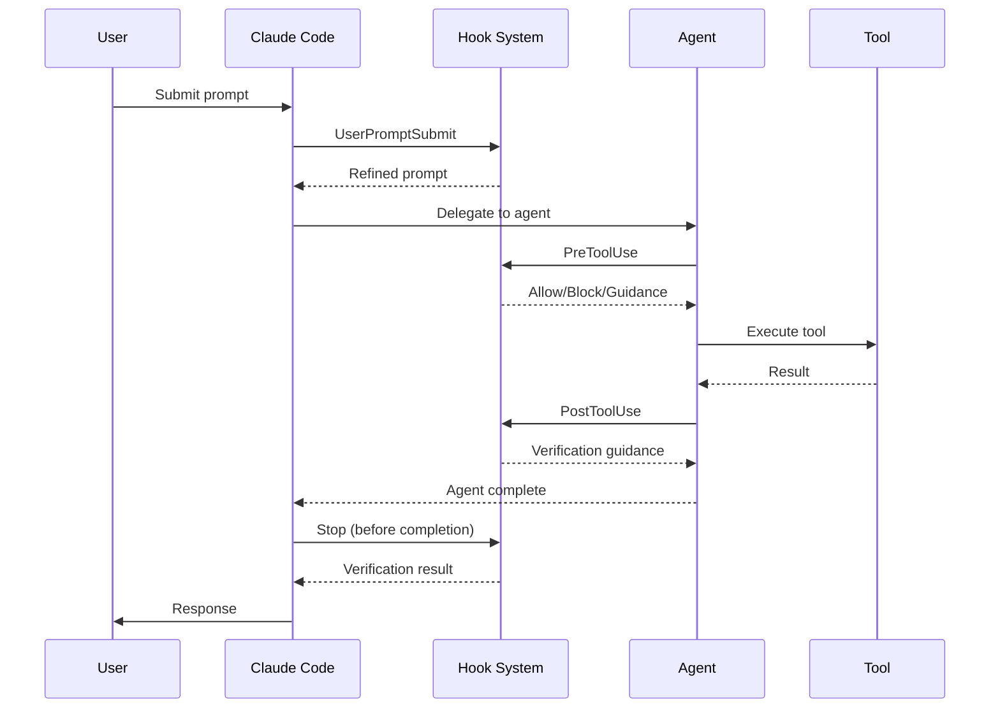

# Hooks Reference

Complete reference for the Agent Flow hook system, including all lifecycle events, matchers, and hook implementations.

## Overview

Hooks are automated actions that trigger at specific points in the Claude Code lifecycle. Agent Flow uses hooks to:

- Refine user prompts before processing
- Guide delegation behavior
- Validate file operations
- Enforce verification gates
- Load project context

## Hook Architecture



## Hook Configuration

Hooks are defined in `hooks/hooks.json`:

```json
{
  "description": "Multi-agent orchestration hooks for verification and context",
  "hooks": {
    "UserPromptSubmit": [...],
    "PreToolUse": [...],
    "PostToolUse": [...],
    "SessionStart": [...],
    "Stop": [...]
  }
}
```

## Hook Types

### Prompt Hooks

Prompt hooks use the LLM to analyze and potentially modify behavior:

```json
{
  "type": "prompt",
  "prompt": "Analyze this user prompt for task clarity...",
  "timeout": 15
}
```

**Properties:**
- `prompt`: Instructions for the LLM
- `timeout`: Maximum seconds to wait (optional)

### Command Hooks

Command hooks execute shell scripts:

```json
{
  "type": "command",
  "command": "bash ${CLAUDE_PLUGIN_ROOT}/hooks/scripts/verify-completion.sh",
  "timeout": 60
}
```

**Properties:**
- `command`: Shell command to execute
- `timeout`: Maximum seconds to wait (optional)

**Environment Variables:**
- `CLAUDE_PLUGIN_ROOT`: Plugin installation directory
- `TOOL_NAME`: Name of the tool being used (PreToolUse/PostToolUse)
- `TOOL_INPUT`: JSON input to the tool (PreToolUse/PostToolUse)

## Lifecycle Events

### UserPromptSubmit

Triggers when the user submits a message, before processing begins.

**Use Cases:**
- Prompt refinement
- Task classification
- Orchestration detection

**Agent Flow Implementation:**

```json
{
  "type": "prompt",
  "prompt": "Analyze this user prompt for task clarity.

If this is an AFFIRMATIVE RESPONSE (yes, ok, sure, continue...):
  Respond with just 'No refinement needed.'

If this is an orchestration/planning task (fix, implement, add...):
- If SPECIFIC: Transform to **Goal** / **Description** / **Actions** format
- If AMBIGUOUS: Ask ONE clarifying question with 2-4 options

If NOT an orchestration task:
  Respond with just 'No refinement needed.'

Be concise.",
  "timeout": 15
}
```

### PreToolUse

Triggers before a tool is executed. Can block, modify, or allow the operation.

**Matcher:** Tool name pattern (e.g., `Write|Edit`)

**Use Cases:**
- Validate file paths
- Provide delegation guidance
- Block dangerous operations

**Agent Flow Implementation:**

```json
{
  "matcher": "Write|Edit",
  "hooks": [
    {
      "type": "command",
      "command": "bash ${CLAUDE_PLUGIN_ROOT}/hooks/scripts/enforce-delegation.sh",
      "timeout": 5
    },
    {
      "type": "command",
      "command": "bash ${CLAUDE_PLUGIN_ROOT}/hooks/scripts/validate-changes.sh",
      "timeout": 30
    }
  ]
}
```

**enforce-delegation.sh:**
- Allows writes to `.senku/` silently (planning files)
- Provides delegation guidance for other file writes
- Does not block - agents handle their own tool restrictions

**validate-changes.sh:**
- Blocks path traversal (`..` in paths)
- Blocks writes to sensitive files (`.env`, credentials, keys)
- Blocks writes to system paths (`/etc`, `/usr`, `/bin`)

### PostToolUse

Triggers after a tool completes execution.

**Matcher:** Tool name pattern (e.g., `Task`, `Write|Edit`)

**Use Cases:**
- Verify delegation results
- Validate file writes
- Provide context-aware guidance

**Agent Flow Implementation (Task):**

```json
{
  "matcher": "Task",
  "hooks": [
    {
      "type": "prompt",
      "prompt": "Agent completed. Verify based on task type:
- **Riko (exploration)**: Accept findings, no code verification needed
- **Senku (planning)**: Review plan completeness
- **Loid (implementation)**: READ changed files, RUN tests, CHECK types
- **Lawliet (review)**: Consider feedback
- **Alphonse (verification)**: Check test results

Only Loid tasks require full code verification.",
      "timeout": 30
    }
  ]
}
```

**Agent Flow Implementation (Write|Edit):**

```json
{
  "matcher": "Write|Edit",
  "hooks": [
    {
      "type": "command",
      "command": "bash ${CLAUDE_PLUGIN_ROOT}/hooks/scripts/validate-changes.sh",
      "timeout": 30
    }
  ]
}
```

### SessionStart

Triggers when a new Claude Code session begins.

**Matcher:** `*` (matches all sessions)

**Use Cases:**
- Detect project type
- Load project context
- Set environment variables

**Agent Flow Implementation:**

```json
{
  "matcher": "*",
  "hooks": [
    {
      "type": "command",
      "command": "bash ${CLAUDE_PLUGIN_ROOT}/scripts/load-project-context.sh",
      "timeout": 10
    }
  ]
}
```

**load-project-context.sh detects:**
- Project type (nodejs, python, rust, go, java)
- Test framework (jest, pytest, cargo-test, etc.)
- Available tooling (TypeScript, ESLint, Ruff)

### Stop

Triggers before task completion, allowing verification gates.

**Use Cases:**
- Run test suites
- Verify type checking
- Check lint errors
- Validate build

**Agent Flow Implementation:**

```json
{
  "hooks": [
    {
      "type": "command",
      "command": "bash ${CLAUDE_PLUGIN_ROOT}/hooks/scripts/verify-completion.sh",
      "timeout": 60
    }
  ]
}
```

**verify-completion.sh:**
- Runs `npm test` / `pytest`
- Runs `npx tsc --noEmit` / `mypy`
- Reports pass/fail status

## Hook Scripts

### enforce-delegation.sh

Provides guidance on delegation patterns when file writes are detected.

**Behavior:**
1. Check if path is `.senku/` directory
2. If yes: Allow silently (planning files)
3. If no: Output delegation guidance message

**Note:** This hook provides context, not enforcement. Agent tool restrictions are the primary control mechanism.

### validate-changes.sh

Validates file operations for security.

**Checks:**
| Check | Pattern | Action |
|-------|---------|--------|
| Path traversal | `..` in path | Block |
| Environment files | `*.env*` | Block |
| Credential files | `*credential*`, `*secret*`, `*.key` | Block |
| System paths | `/etc/*`, `/usr/*`, `/bin/*` | Block |

**Exit Codes:**
- `0`: Validation passed
- `1`: Validation failed (operation blocked)

### verify-completion.sh

Runs verification gates before task completion.

**Process:**
1. Detect project type from markers
2. Run appropriate test command
3. Run type checking if available
4. Report results

**Project Detection:**
| Marker | Project Type | Test Command |
|--------|--------------|--------------|
| `package.json` | Node.js | `npm test` |
| `pyproject.toml` | Python | `pytest` |
| `Cargo.toml` | Rust | `cargo test` |
| `go.mod` | Go | `go test ./...` |

## Creating Custom Hooks

### Prompt Hook Template

```json
{
  "type": "prompt",
  "prompt": "Your instructions here. Be specific about:
- What to analyze
- What actions to take
- What output format to use

Context available: $TOOL_NAME, $TOOL_INPUT (for tool hooks)",
  "timeout": 30
}
```

### Command Hook Template

```bash
#!/bin/bash
# hooks/scripts/my-hook.sh

set -euo pipefail

# Access environment variables
TOOL_NAME="${TOOL_NAME:-}"
TOOL_INPUT="${TOOL_INPUT:-}"

# Your logic here
if [[ some_condition ]]; then
  echo '{"continue": true, "systemMessage": "Guidance message"}'
  exit 0  # Allow operation
else
  echo '{"continue": false, "systemMessage": "Error: reason"}'
  exit 2  # Block operation
fi
```

### Adding Hooks

1. Create script in `hooks/scripts/`
2. Add hook definition to `hooks/hooks.json`
3. Test with a sample operation

```json
{
  "matcher": "YourTool",
  "hooks": [
    {
      "type": "command",
      "command": "bash ${CLAUDE_PLUGIN_ROOT}/hooks/scripts/my-hook.sh",
      "timeout": 10
    }
  ]
}
```

## Hook Execution Order

When multiple hooks match, they execute in array order:

```json
{
  "matcher": "Write|Edit",
  "hooks": [
    { "command": "first-hook.sh" },   // Runs first
    { "command": "second-hook.sh" }   // Runs second
  ]
}
```

If any hook fails (exits non-zero), subsequent hooks do not run and the operation is blocked.

## Debugging Hooks

### Check Hook Registration

Verify hooks are loaded by examining the configuration:

```bash
cat hooks/hooks.json | jq '.hooks'
```

### Test Hook Scripts

Run scripts directly with test inputs:

```bash
TOOL_NAME="Write" TOOL_INPUT='{"file_path": "/test/file.ts"}' \
  bash hooks/scripts/validate-changes.sh
```

### View Hook Output

Hook output appears in the Claude Code response. For command hooks:
- stdout: JSON response (both allow and block responses)
- Exit code: 0 = allow, 2 = block

## Related Documentation

- [Verification Gates](../concepts/evidence-based-verification.md) - Verification philosophy
- [State Files](state-files.md) - State tracking format
- [Commands Reference](commands.md) - Command specifications
