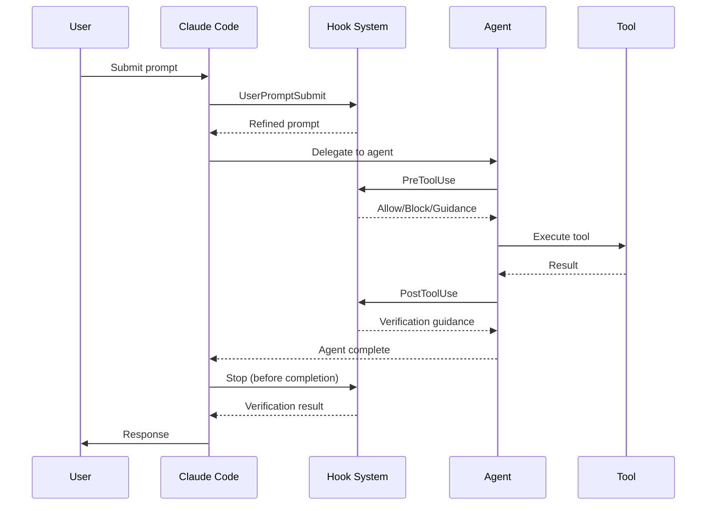
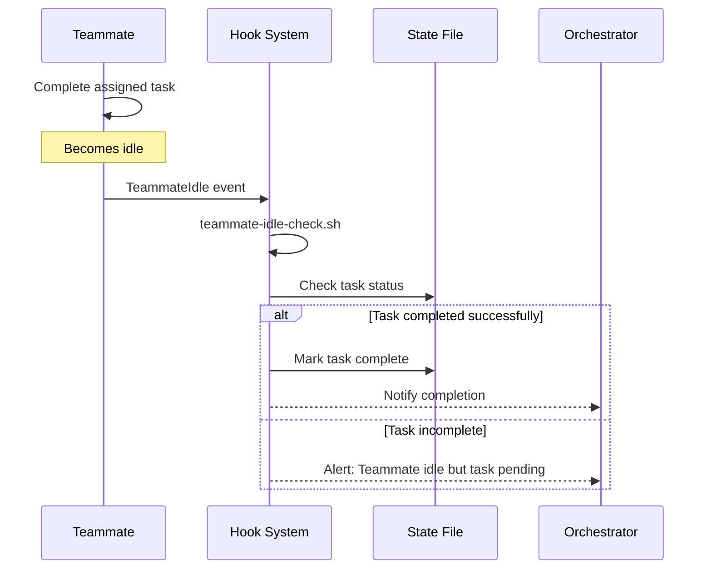
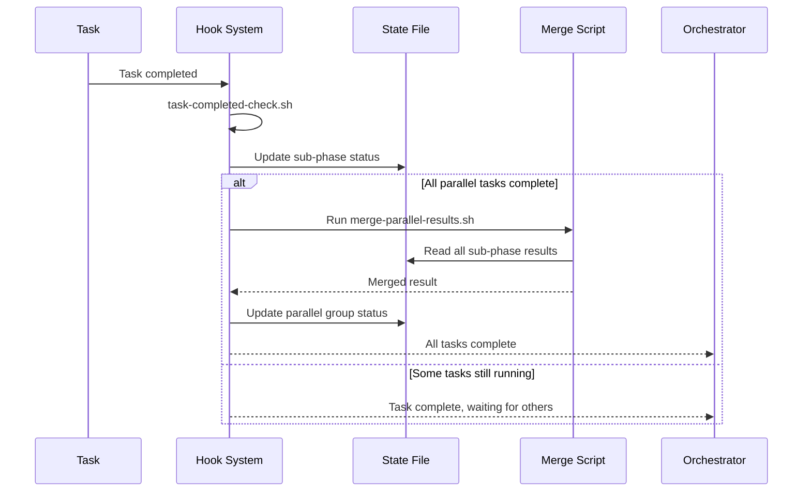

# Hooks Reference

Complete reference for the Agent Flow hook system, including all lifecycle events, matchers, and hook implementations.

## Overview

Hooks are automated actions that trigger at specific points in the Claude Code lifecycle. Agent Flow uses hooks to:

- Refine user prompts before processing
- Guide delegation behavior
- Validate file operations
- Enforce verification gates
- Load project context

## Hook Architecture


```mermaid
sequenceDiagram
    participant U as User
    participant C as Claude Code
    participant H as Hook System
    participant A as Agent
    participant T as Tool

    U->>C: Submit prompt
    C->>H: UserPromptSubmit
    H-->>C: Refined prompt

    C->>A: Delegate to agent
    A->>H: PreToolUse
    H-->>A: Allow/Block/Guidance
    A->>T: Execute tool
    T-->>A: Result
    A->>H: PostToolUse
    H-->>A: Verification guidance

    A-->>C: Agent complete
    C->>H: Stop (before completion)
    H-->>C: Verification result
    C->>U: Response
```

## Hook Configuration

Hooks are defined in `hooks/hooks.json`:

```json
{
  "description": "Multi-agent orchestration hooks for verification and context",
  "hooks": {
    "UserPromptSubmit": [...],
    "PreToolUse": [...],
    "PostToolUse": [...],
    "SubagentStop": [...],
    "SessionEnd": [...],
    "SessionStart": [...],
    "Stop": [...],
    "TeammateIdle": [...],
    "TaskCompleted": [...]
  }
}
```

## Hook Types

### Prompt Hooks

Prompt hooks use the LLM to analyze and potentially modify behavior:

```json
{
  "type": "prompt",
  "prompt": "Analyze this user prompt for task clarity...",
  "timeout": 15
}
```

**Properties:**
- `prompt`: Instructions for the LLM
- `timeout`: Maximum seconds to wait (optional)

### Command Hooks

Command hooks execute shell scripts:

```json
{
  "type": "command",
  "command": "bash ${CLAUDE_PLUGIN_ROOT}/hooks/scripts/verify-completion.sh",
  "timeout": 60
}
```

**Properties:**
- `command`: Shell command to execute
- `timeout`: Maximum seconds to wait (optional)

**Environment Variables:**
- `CLAUDE_PLUGIN_ROOT`: Plugin installation directory
- `TOOL_NAME`: Name of the tool being used (PreToolUse/PostToolUse)
- `TOOL_INPUT`: JSON input to the tool (PreToolUse/PostToolUse)

## Lifecycle Events

### Core Lifecycle Events

The following hooks trigger during standard orchestration workflows.

#### UserPromptSubmit

Triggers when the user submits a message, before processing begins.

**Use Cases:**
- Prompt refinement
- Task classification
- Orchestration detection

**Agent Flow Implementation:**

```json
{
  "type": "prompt",
  "prompt": "Analyze this user prompt for task clarity.

If this input is a system-generated notification rather than literal
user-typed text (e.g. a <task-notification> for a completed
background/subagent task, or any other automated event payload):
  Respond with just 'No refinement needed.' and do not explain your
  reasoning or evaluate it further.

If this is an AFFIRMATIVE RESPONSE (yes, ok, sure, continue...):
  Respond with just 'No refinement needed.'

If this is an orchestration/planning task (fix, implement, add...):
- If SPECIFIC: Transform to **Goal** / **Description** / **Actions** format
- If AMBIGUOUS: Ask ONE clarifying question with 2-4 options

If NOT an orchestration task:
  Respond with just 'No refinement needed.'

Be concise.",
  "timeout": 15
}
```

!!! note
    Newer Claude Code versions route background/subagent task-completion
    notifications through the same `UserPromptSubmit` channel as literal
    user input. Without the system-generated-notification branch above,
    the LLM behind this hook has no matching case for a `<task-notification>`
    payload, so it produces free-form meta-commentary instead of the
    `No refinement needed.` sentinel — which the harness then surfaces to
    the user as `Operation stopped by hook: <that text>`. The branch
    restores the safe fallback for this payload shape. The prompt also
    assumes it sees only the single current message (so it won't demand
    clarification for pronoun- or prior-context-based follow-ups that lack
    a concrete task verb, like "fix it" or "did that work?") and biases
    toward the `No refinement needed.` sentinel when
    uncertain, minimizing false clarification prompts.

#### PreToolUse

Triggers before a tool is executed. Can block, modify, or allow the operation.

**Matcher:** Tool name pattern (e.g., `Write|Edit`)

**Use Cases:**
- Validate file paths
- Provide delegation guidance
- Block dangerous operations

**Agent Flow Implementation:**

```json
{
  "matcher": "Write|Edit",
  "hooks": [
    {
      "type": "command",
      "command": "bash ${CLAUDE_PLUGIN_ROOT}/hooks/scripts/enforce-delegation.sh",
      "timeout": 5
    },
    {
      "type": "command",
      "command": "bash ${CLAUDE_PLUGIN_ROOT}/hooks/scripts/validate-changes.sh",
      "timeout": 30
    }
  ]
}
```

**enforce-delegation.sh:**
- Allows writes to `.senku/` silently (planning files)
- Provides delegation guidance for other file writes
- Does not block - agents handle their own tool restrictions

**validate-changes.sh:**
- Blocks path traversal (`..` in paths)
- Blocks writes to sensitive files (`.env`, credentials, keys)
- Blocks writes to system paths (`/etc`, `/usr`, `/bin`)

#### PostToolUse

Triggers after a tool completes execution.

**Matcher:** Tool name pattern (e.g., `Agent|Task`, `Write|Edit`)

**Use Cases:**
- Verify delegation results
- Validate file writes
- Provide context-aware guidance

**Agent Flow Implementation (Agent|Task):**

```json
{
  "matcher": "Agent|Task",
  "hooks": [
    {
      "type": "prompt",
      "prompt": "Agent completed. Verify based on task type:
- **Riko (exploration)**: Accept findings, no code verification needed
- **Senku (planning)**: Review plan completeness
- **Loid (implementation)**: READ changed files, RUN tests, CHECK types
- **Lawliet (review)**: Consider feedback
- **Alphonse (verification)**: Check test results

Only Loid tasks require full code verification.",
      "timeout": 30
    }
  ]
}
```

**Agent Flow Implementation (Write|Edit):**

```json
{
  "matcher": "Write|Edit",
  "hooks": [
    {
      "type": "command",
      "command": "bash ${CLAUDE_PLUGIN_ROOT}/hooks/scripts/validate-changes.sh",
      "timeout": 30
    }
  ]
}
```

#### SessionStart

Triggers when a new Claude Code session begins.

**Matcher:** `*` (matches all sessions)

**Use Cases:**
- Detect project type
- Load project context
- Set environment variables

**Agent Flow Implementation:**

```json
{
  "matcher": "*",
  "hooks": [
    {
      "type": "command",
      "command": "bash ${CLAUDE_PLUGIN_ROOT}/scripts/load-project-context.sh",
      "timeout": 10
    },
    {
      "type": "command",
      "command": "bash -c 'GRAPH_PATH=\"${CLAUDE_PROJECT_DIR:-$(pwd)}/graphify-out/graph.json\"; if [ -f \"$GRAPH_PATH\" ] && [ -n \"${CLAUDE_ENV_FILE:-}\" ]; then echo \"export AGENT_FLOW_GRAPH_PATH=$GRAPH_PATH\" >> \"$CLAUDE_ENV_FILE\"; fi; exit 0'",
      "timeout": 5
    }
  ]
}
```

**load-project-context.sh detects:**
- Project type (nodejs, python, rust, go, java)
- Test framework (jest, pytest, cargo-test, etc.)
- Available tooling (TypeScript, ESLint, Ruff)

**Graph path export (second command):**
When `graphify-out/graph.json` exists in the project, exports `AGENT_FLOW_GRAPH_PATH` into `$CLAUDE_ENV_FILE` so the graphify MCP server can discover the knowledge graph. Exits silently when the graph or env file is absent.

#### Stop

Triggers before task completion, allowing verification gates.

**Use Cases:**
- Run test suites
- Verify type checking
- Check lint errors
- Validate build

**Agent Flow Implementation:**

```json
{
  "hooks": [
    {
      "type": "command",
      "command": "bash ${CLAUDE_PLUGIN_ROOT}/hooks/scripts/verify-completion.sh",
      "timeout": 60
    }
  ]
}
```

**verify-completion.sh:**
- Runs `npm test` / `pytest`
- Runs `npx tsc --noEmit` / `mypy` (when `mypy.ini` is present)
- Reports pass/fail status
- Blocks with an explicit reason if it cannot `cd` into the project directory (never runs checks from the wrong directory)
- Builds all decision JSON via `jq`, so reasons containing quotes or special characters cannot corrupt the output

**Advanced features:**
1. **Bypass**: Create `.claude/skip-test-verification` file to skip all verification (first line = reason)
2. **Custom test commands**: Create `.claude/test-command` file to override default test command
3. **Known failures**: Create `.claude/known-test-failures` file with expected failures (one per line, # for comments)
4. **uv support**: Uses `uv run pytest` when uv is available and `uv.lock` exists
5. **Priority**: custom command > uv run pytest > bare pytest

**Security note — `.claude/test-command` is a trust boundary.** The file's first non-comment line is executed verbatim via `bash -c` with the Stop hook's privileges. Anyone (or any tool) with write access to `.claude/` can execute arbitrary commands when the hook fires. Treat `.claude/` with the same review discipline as build scripts; never populate `test-command` from untrusted input.

### Team Orchestration Events

The following hooks trigger during team orchestration workflows when using Agent Teams.

#### TeammateIdle

Triggers when a teammate in an Agent Team has no active tasks.

**Use Cases:**
- Monitor teammate status
- Check if task completed
- Provide guidance for idle teammates
- Detect completion of parallel tasks

**Agent Flow Implementation:**

```json
{
  "TeammateIdle": [
    {
      "hooks": [
        {
          "type": "command",
          "command": "bash ${CLAUDE_PLUGIN_ROOT}/hooks/scripts/teammate-idle-check.sh",
          "timeout": 30
        }
      ]
    }
  ]
}
```

**teammate-idle-check.sh behavior:**
1. Receives JSON input from stdin with `teammate_role` and `teammate_output` fields
2. Performs role-based quality checks
3. Returns approval decision or blocks with reason

**Input:**
- JSON from stdin with `teammate_role` and `teammate_output` fields

**Role-based checks:**
- **Reviewer (Lawliet)**: Must contain verdict (APPROVED/NEEDS_CHANGES/BLOCKED) + static analysis evidence
- **Verifier (Alphonse)**: Must contain at least 2 verification gate results + command output
- **Other roles**: Approved without specific checks

**Typical Flow:**

```mermaid
sequenceDiagram
    participant T as Teammate
    participant H as Hook System
    participant S as State File
    participant O as Orchestrator

    T->>T: Complete assigned task
    Note over T: Becomes idle
    T->>H: TeammateIdle event
    H->>H: teammate-idle-check.sh
    H->>S: Check task status
    alt Task completed successfully
        H->>S: Mark task complete
        H-->>O: Notify completion
    else Task incomplete
        H-->>O: Alert: Teammate idle but task pending
    end
```

#### TaskCompleted

Triggers when a task within an Agent Team completes.

**Use Cases:**
- Update parallel group state
- Check if all parallel tasks completed
- Trigger result merging
- Transition to next phase

**Agent Flow Implementation:**

```json
{
  "TaskCompleted": [
    {
      "hooks": [
        {
          "type": "command",
          "command": "bash ${CLAUDE_PLUGIN_ROOT}/hooks/scripts/task-completed-check.sh",
          "timeout": 15
        }
      ]
    }
  ]
}
```

**task-completed-check.sh behavior:**
1. Receives JSON input from stdin with `task_status` and `completion_message` fields
2. Only validates tasks marked as complete/done/finished
3. Checks completion message for concrete evidence
4. Returns approval decision or blocks with reason

**Input:**
- JSON from stdin with `task_status` and `completion_message` fields

**Evidence checks:**
- Message length >= 20 characters
- Contains file mentions, verification indicators, concrete actions, or results/metrics
- Tasks not marked complete are approved without validation

**Typical Flow:**

```mermaid
sequenceDiagram
    participant T as Task
    participant H as Hook System
    participant S as State File
    participant M as Merge Script
    participant O as Orchestrator

    T->>H: Task completed
    H->>H: task-completed-check.sh
    H->>S: Update sub-phase status

    alt All parallel tasks complete
        H->>M: Run merge-parallel-results.sh
        M->>S: Read all sub-phase results
        M-->>H: Merged result
        H->>S: Update parallel group status
        H-->>O: All tasks complete
    else Some tasks still running
        H-->>O: Task complete, waiting for others
    end
```

**State Updates:**

Before task completion:
```yaml
parallel_groups:
  review_verification:
    status: "in_progress"
    review:
      status: "in_progress"
    verification:
      status: "in_progress"
```

After one task completes:
```yaml
parallel_groups:
  review_verification:
    status: "in_progress"
    review:
      status: "passed"
      result: "APPROVED"
      timestamp: "2024-01-15T10:46:30Z"
    verification:
      status: "in_progress"
```

After all tasks complete:
```yaml
parallel_groups:
  review_verification:
    status: "passed"
    completed_at: "2024-01-15T10:47:15Z"
    review:
      status: "passed"
      result: "APPROVED"
      timestamp: "2024-01-15T10:46:30Z"
    verification:
      status: "passed"
      result: "VERIFIED"
      timestamp: "2024-01-15T10:47:15Z"
```

## Hook Scripts

### enforce-delegation.sh

Provides guidance on delegation patterns when file writes are detected.

**Behavior:**
1. Check if path is `.senku/` directory
2. If yes: Allow silently (planning files)
3. If no: Output delegation guidance message

**Note:** This hook provides context, not enforcement. Agent tool restrictions are the primary control mechanism.

### validate-changes.sh

Validates file operations for security.

**Checks:**
| Check | Pattern | Action |
|-------|---------|--------|
| Path traversal | `..` in path | Block |
| Environment files | `*.env`, `*.env.*` | Block |
| Credential files | `*credentials*`, `*secret*`, `*.key`, `*.pem`, `*id_rsa*`, `*id_ed25519*` | Block |
| System paths | `/etc/*`, `/usr/*`, `/bin/*`, `/sbin/*`, `/var/*`, `/root/*` | Block |

**Exit Codes:**
- `0`: Always returns 0 (blocking decisions via `"continue": false` in JSON output)

### verify-completion.sh

Runs verification gates before task completion.

**Process:**
1. Detect project type from markers
2. `cd` into the project directory — if inaccessible, block with `Verification failed: project directory inaccessible`
3. Run appropriate test command
4. Run type checking if available
5. Report results

**Project Detection:**
| Marker | Project Type | Test Command |
|--------|--------------|--------------|
| `package.json` | Node.js | `npm test` |
| `pyproject.toml` | Python | `pytest` |
| `Cargo.toml` | Rust | `cargo test` |
| `go.mod` | Go | `go test ./...` |

### teammate-idle-check.sh

Validates teammate output quality using role-based criteria.

**Purpose:** Ensure teammates produce sufficient evidence for their role before approval.

**Input:**
- JSON from stdin with `teammate_role` and `teammate_output` fields

**Behavior:**
1. Extract teammate role and output from JSON stdin
2. Apply role-specific quality checks:
   - **Reviewer (Lawliet)**: Requires verdict (APPROVED/NEEDS_CHANGES/BLOCKED) + static analysis evidence (type check, lint, code quality, security, pattern)
   - **Verifier (Alphonse)**: Requires at least 2 verification gate results (tests, types, lint, build) + command output (not just status)
   - **Other roles**: Approved without specific checks
3. Return approval or block decision

**Exit Codes:**
- `0`: Returns JSON decision (approve or block based on quality checks)

**Output Format:**
```json
{
  "decision": "approve|block",
  "reason": "Quality check result description",
  "systemMessage": "System status message"
}
```

**Example Outputs:**
```json
{
  "decision": "block",
  "reason": "Reviewer output must contain verdict (APPROVED/NEEDS_CHANGES/BLOCKED)",
  "systemMessage": "Reviewer idle check failed: missing verdict"
}
```

```json
{
  "decision": "approve",
  "reason": "Teammate idle check passed",
  "systemMessage": "Teammate quality requirements met"
}
```

### task-completed-check.sh

Validates task completion messages for concrete evidence of work.

**Purpose:** Ensure task completions contain meaningful evidence, not just status updates.

**Input:**
- JSON from stdin with `task_status` and `completion_message` fields

**Behavior:**
1. Extract task status and completion message from JSON stdin
2. Only validate tasks marked as "complete", "done", or "finished"
3. Check completion message for concrete evidence:
   - Message length >= 20 characters
   - File mentions (file paths, extensions, directories)
   - Verification indicators (test, verified, checked, passed, validated, built, compiled)
   - Concrete actions (created, updated, modified, fixed, added, removed, refactored, implemented)
   - Results/metrics (numbers with units like "5 files", "10 tests", "0 errors")
4. Return approval or block decision

**Exit Codes:**
- `0`: Returns JSON decision (approve or block based on evidence checks)

**Output Format:**
```json
{
  "decision": "approve|block",
  "reason": "Evidence check result description",
  "systemMessage": "System status message"
}
```

**Example Outputs:**
```json
{
  "decision": "block",
  "reason": "Completion message too short - must provide concrete evidence of completion",
  "systemMessage": "Task completion check failed: insufficient completion message"
}
```

```json
{
  "decision": "approve",
  "reason": "Task completion check passed",
  "systemMessage": "Task completion has adequate evidence"
}
```

## Observability Hooks

Four hooks feed the live observability sink. They write events to `.claude/observability/events.db` in the background; if the database is locked they fall back to `.claude/observability/events.jsonl`. Hook latency is ~30 ms p95 (Python cold start) and does not block the orchestration control flow.

The live sink is implemented by `hooks/scripts/log-event.py`, invoked via the thin wrapper `hooks/scripts/log-event.sh` (which resolves a Python interpreter — preferring the plugin's `.venv` — and execs the Python sink). The separate `scripts/analyze/analyze.py` is the **offline** load/report tool (subcommands: `load`, `report`, `sessions`, `sql`, `label`, `export`, `retention`); it is not wired into any hook.

!!! note
    A pre-existing `PostToolUse` entry previously used the matcher `Task`. That matcher was broadened to `Agent|Task` so that both tool names are captured. If you are running an older installation, update your `hooks/hooks.json` accordingly.

| Hook event | Matcher | Purpose |
|------------|---------|---------|
| `PreToolUse` | `Agent\|Task` | Captures the subagent dispatch — records tool input (prompt, model, description) before the subagent runs |
| `PostToolUse` | *(matcherless — all tools)* | Records tool results and token usage after every tool call in the session |
| `SubagentStop` | — | Records the final output and timing when a subagent finishes |
| `SessionEnd` | — | Marks the session closed in the `sessions` table; triggers any configured exporters |

### Configuration

The four entries in `hooks/hooks.json` look like:

```json
{
  "PreToolUse": [
    {
      "matcher": "Agent|Task",
      "hooks": [
        {
          "type": "command",
          "command": "bash ${CLAUDE_PLUGIN_ROOT}/hooks/scripts/log-event.sh preToolUse",
          "timeout": 5
        }
      ]
    }
  ],
  "PostToolUse": [
    {
      "matcher": "",
      "hooks": [
        {
          "type": "command",
          "command": "bash ${CLAUDE_PLUGIN_ROOT}/hooks/scripts/log-event.sh postToolUse",
          "timeout": 5
        }
      ]
    }
  ],
  "SubagentStop": [
    {
      "hooks": [
        {
          "type": "command",
          "command": "bash ${CLAUDE_PLUGIN_ROOT}/hooks/scripts/log-event.sh subagentStop",
          "timeout": 5
        }
      ]
    }
  ],
  "SessionEnd": [
    {
      "hooks": [
        {
          "type": "command",
          "command": "bash ${CLAUDE_PLUGIN_ROOT}/hooks/scripts/log-event.sh sessionEnd",
          "timeout": 5
        }
      ]
    }
  ]
}
```

To disable live collection, comment out these four entries or remove `.claude/observability/events.db`. The offline parser (`bash scripts/analyze.sh load`) continues to work from stored JSONL transcripts.

See [Using Analyze](../guides/using-analyze.md) for the full observability workflow.

---

## Creating Custom Hooks

### Prompt Hook Template

```json
{
  "type": "prompt",
  "prompt": "Your instructions here. Be specific about:
- What to analyze
- What actions to take
- What output format to use

Context available: $TOOL_NAME, $TOOL_INPUT (for tool hooks)",
  "timeout": 30
}
```

### Command Hook Template

```bash
#!/bin/bash
# hooks/scripts/my-hook.sh

set -euo pipefail

# Access environment variables
TOOL_NAME="${TOOL_NAME:-}"
TOOL_INPUT="${TOOL_INPUT:-}"

# Your logic here
if [[ some_condition ]]; then
  echo '{"continue": true, "systemMessage": "Guidance message"}'
  exit 0  # Allow operation
else
  echo '{"continue": false, "systemMessage": "Error: reason"}'
  exit 0  # Block operation (JSON decision controls behavior)
fi
```

### Adding Hooks

1. Create script in `hooks/scripts/`
2. Add hook definition to `hooks/hooks.json`
3. Test with a sample operation

```json
{
  "matcher": "YourTool",
  "hooks": [
    {
      "type": "command",
      "command": "bash ${CLAUDE_PLUGIN_ROOT}/hooks/scripts/my-hook.sh",
      "timeout": 10
    }
  ]
}
```

## Hook Execution Order

When multiple hooks match, they execute in array order:

```json
{
  "matcher": "Write|Edit",
  "hooks": [
    { "command": "first-hook.sh" },   // Runs first
    { "command": "second-hook.sh" }   // Runs second
  ]
}
```

If any hook fails (exits non-zero), subsequent hooks do not run and the operation is blocked.

## Debugging Hooks

### Check Hook Registration

Verify hooks are loaded by examining the configuration:

```bash
cat hooks/hooks.json | jq '.hooks'
```

### Test Hook Scripts

Run scripts directly with test inputs:

```bash
TOOL_NAME="Write" TOOL_INPUT='{"file_path": "/test/file.ts"}' \
  bash hooks/scripts/validate-changes.sh
```

### View Hook Output

Hook output appears in the Claude Code response. For command hooks:
- stdout: JSON response with `"decision": "approve"` or `"decision": "block"`
- Exit code: Always 0 (JSON decision field controls allow/block behavior)

## Related Documentation

- [Verification Gates](../concepts/evidence-based-verification.md) - Verification philosophy
- [State Files](state-files.md) - State tracking format
- [Commands Reference](commands.md) - Command specifications
