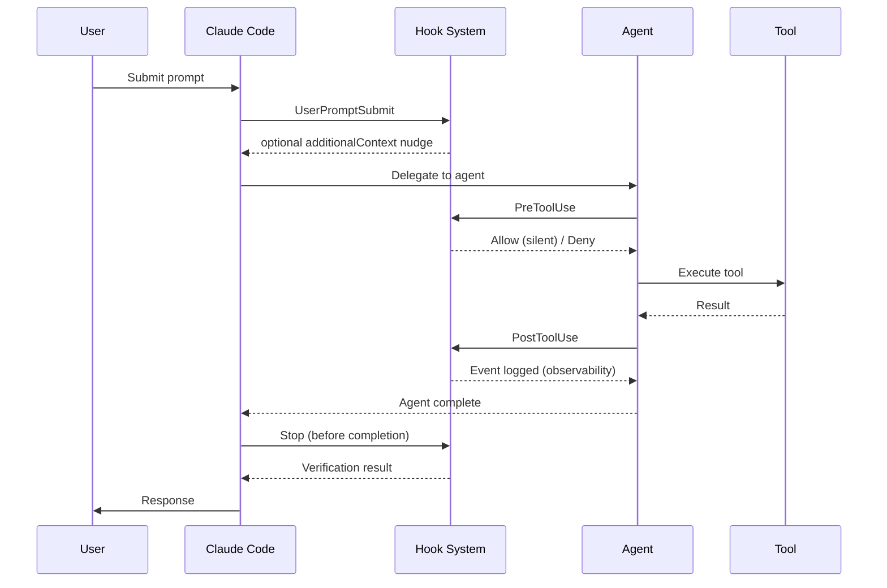

# Hooks Reference

Complete reference for the Agent Flow hook system, including all lifecycle events, matchers, and hook implementations.

## Overview

Hooks are automated actions that trigger at specific points in the Claude Code lifecycle. Agent Flow uses hooks to:

- Deterministic prompt-refinement gate (skip or nudge; never blocks)
- Validate file operations
- Enforce verification gates
- Load project context

## Hook Architecture


```mermaid
sequenceDiagram
    participant U as User
    participant C as Claude Code
    participant H as Hook System
    participant A as Agent
    participant T as Tool

    U->>C: Submit prompt
    C->>H: UserPromptSubmit
    H-->>C: optional additionalContext nudge

    C->>A: Delegate to agent
    A->>H: PreToolUse
    H-->>A: Allow (silent) / Deny
    A->>T: Execute tool
    T-->>A: Result
    A->>H: PostToolUse
    H-->>A: Event logged (observability)

    A-->>C: Agent complete
    C->>H: Stop (before completion)
    H-->>C: Verification result
    C->>U: Response
```

## Hook Configuration

Hooks are defined in `hooks/hooks.json`:

```json
{
  "description": "Multi-agent orchestration hooks for verification and context",
  "hooks": {
    "UserPromptSubmit": [...],
    "PreToolUse": [...],
    "PostToolUse": [...],
    "SubagentStop": [...],
    "SessionEnd": [...],
    "SessionStart": [...],
    "Stop": [...]
  }
}
```

All command strings quote the script path (`bash "${CLAUDE_PLUGIN_ROOT}/..."`) so plugin installs under paths containing spaces still work.

!!! note "Removed hooks"
    The following entries were removed because they were no-ops or actively harmful on current Claude Code:

    - **`enforce-delegation.sh` (PreToolUse)** — emitted only an invalid `message` field and never influenced behavior.
    - **PostToolUse `prompt` hook on `Agent|Task`** — cost one Haiku call per subagent and falsely blocked background/fork agents.
    - **Duplicate PostToolUse `validate-changes.sh`** — validation now runs once, in PreToolUse.
    - **`TeammateIdle` / `TaskCompleted` (`teammate-idle-check.sh`, `task-completed-check.sh`)** — read fields (`teammate_role`, `task_status`) that do not exist in current hook input, so they never did anything.

## Hook Types

### Prompt Hooks

Prompt hooks use the LLM to analyze and potentially modify behavior:

```json
{
  "type": "prompt",
  "prompt": "Analyze this user prompt for task clarity...",
  "timeout": 15
}
```

**Properties:**
- `prompt`: Instructions for the LLM
- `timeout`: Maximum seconds to wait (optional)

### Command Hooks

Command hooks execute shell scripts:

```json
{
  "type": "command",
  "command": "bash \"${CLAUDE_PLUGIN_ROOT}/hooks/scripts/verify-completion.sh\"",
  "timeout": 300
}
```

**Properties:**
- `command`: Shell command to execute
- `timeout`: Maximum seconds to wait (optional)

**Environment Variables:**
- `CLAUDE_PLUGIN_ROOT`: Plugin installation directory
- `TOOL_NAME`: Name of the tool being used (PreToolUse/PostToolUse)
- `TOOL_INPUT`: JSON input to the tool (PreToolUse/PostToolUse)

## Lifecycle Events

### Core Lifecycle Events

The following hooks trigger during standard orchestration workflows.

#### UserPromptSubmit

Triggers when the user submits a message, before processing begins.

**Use Cases:**
- Prompt refinement nudge
- Task classification
- Orchestration detection

**Agent Flow Implementation:**

```json
{
  "type": "command",
  "command": "bash \"${CLAUDE_PLUGIN_ROOT}/hooks/scripts/refine-prompt-gate.sh\"",
  "timeout": 10
}
```

This is a **deterministic command hook** (`hooks/scripts/refine-prompt-gate.sh`), not an LLM prompt hook — it never blocks and never asks the LLM to judge clarity. It runs a fixed sequence of checks against the raw prompt text:

1. **Notification skip** — if the prompt contains `<task-notification` or otherwise looks like a system-generated tag payload (starts with `<`), exit silently. This replaces the old LLM-judged "is this a notification" branch with a literal string check, so notifications can never produce stray meta-commentary that the harness surfaces as `Operation stopped by hook: <text>`.
2. **Mid-orchestration skip (24h staleness guard)** — if `.claude/orchestration.local.md` exists, is `active: true`, `current_phase` is not `complete`, and was modified within the last 1440 minutes (24h), exit silently. This prevents the hook from nudging refinement mid-run, while a stale/abandoned state file (older than 24h, or already marked terminal) no longer suppresses the nudge for a genuinely new task. See `commands/orchestrate.md`'s Iteration Handling section for how the orchestrator marks a run terminal on abort.
3. **Short pronoun follow-up skip** — prompts like "fix it", "update that", or any ≤4-word prompt containing `it`/`that`/`them`/`this`/`again` are never nudged, since they almost always refer to something already established in the conversation.
4. **Refinement nudge** — if the prompt has a task verb (fix, implement, add, refactor, debug, build, create, update, change, modify) but no concrete-target token (filename with extension, path, CamelCase/snake_case identifier, or quoted string), emit an `additionalContext` payload telling the assistant to apply the prompt-refinement skill (ask one clarifying question only if scope is genuinely ambiguous; otherwise state an assumption and proceed).
5. All other cases exit silently with no output.

The hook is fail-open: if `jq` is unavailable or the prompt is empty, it exits 0 immediately. It never emits `decision: block`.

#### PreToolUse

Triggers before a tool is executed. Can block, modify, or allow the operation.

**Matcher:** Tool name pattern (e.g., `Write|Edit`)

**Use Cases:**
- Validate file paths
- Block dangerous operations

**Agent Flow Implementation:**

```json
{
  "matcher": "Write|Edit",
  "hooks": [
    {
      "type": "command",
      "command": "bash \"${CLAUDE_PLUGIN_ROOT}/hooks/scripts/validate-changes.sh\"",
      "timeout": 10
    }
  ]
}
```

**validate-changes.sh:**
- Denies path traversal (`..` as a path segment — filenames merely containing `..` are allowed)
- Denies writes to sensitive files (`.env`, keys, credentials, secrets — see [validate-changes.sh](#validate-changessh))
- Denies writes to system paths (`/etc`, `/usr`, `/bin`, ...), except temp dirs under `/var/folders` and `/var/tmp`
- Denies via `hookSpecificOutput.permissionDecision: "deny"`, which rejects only that tool call (the old `continue: false` halted the whole session); silent on allow

A second PreToolUse entry (`Agent|Task` → `log-event.sh preToolUse`) is part of the [observability hooks](#observability-hooks).

#### PostToolUse

Triggers after a tool completes execution.

Agent Flow's only PostToolUse entry is the matcherless observability logger (`log-event.sh postToolUse`) — see [Observability Hooks](#observability-hooks). The former `Agent|Task` LLM prompt hook and the duplicate `Write|Edit` validate-changes entry were removed (see [Removed hooks](#hook-configuration)).

#### SessionStart

Triggers when a new Claude Code session begins.

**Matcher:** `*` (matches all sessions)

**Use Cases:**
- Detect project type
- Load project context
- Set environment variables

**Agent Flow Implementation:**

```json
{
  "matcher": "*",
  "hooks": [
    {
      "type": "command",
      "command": "bash \"${CLAUDE_PLUGIN_ROOT}/scripts/load-project-context.sh\"",
      "timeout": 10
    },
    {
      "type": "command",
      "command": "bash -c 'GRAPH_PATH=\"${CLAUDE_PROJECT_DIR:-$(pwd)}/graphify-out/graph.json\"; if [ -f \"$GRAPH_PATH\" ] && [ -n \"${CLAUDE_ENV_FILE:-}\" ]; then echo \"export AGENT_FLOW_GRAPH_PATH=$GRAPH_PATH\" >> \"$CLAUDE_ENV_FILE\"; fi; exit 0'",
      "timeout": 5
    }
  ]
}
```

**load-project-context.sh detects:**
- Project type (nodejs, python, rust, go, java)
- Test framework (jest, pytest, cargo-test, etc.)
- Available tooling (TypeScript, ESLint, Ruff)

**Graph path export (second command):**
When `graphify-out/graph.json` exists in the project, exports `AGENT_FLOW_GRAPH_PATH` into `$CLAUDE_ENV_FILE` so the graphify MCP server can discover the knowledge graph. Exits silently when the graph or env file is absent.

#### Stop

Triggers before task completion, allowing verification gates.

**Use Cases:**
- Run test suites
- Verify type checking
- Check lint errors
- Validate build

**Agent Flow Implementation:**

```json
{
  "hooks": [
    {
      "type": "command",
      "command": "bash \"${CLAUDE_PLUGIN_ROOT}/hooks/scripts/verify-completion.sh\"",
      "timeout": 300
    }
  ]
}
```

**verify-completion.sh:**
- **Change gate:** in a git repo with no uncommitted non-doc changes (excluding `*.md`, `*.rst`, `*.txt`, `docs/`, `.claude/`), exits instantly — Q&A and docs-only turns never run tests
- **Pass cache:** stores the passing change fingerprint in `.claude/.verify-completion-pass`; an unchanged working tree is not re-verified
- Runs `npm test` / `pytest` (npm's `"no test specified"` placeholder script is treated as no tests)
- Runs `npx tsc --noEmit` / `mypy` (when `mypy.ini` is present)
- Silent on success (no `decision: approve` output); tool output goes to stderr so stdout stays a single JSON object
- Block reasons include the last 15 lines of the failing command's output
- Blocks with an explicit reason if it cannot `cd` into the project directory (never runs checks from the wrong directory)
- Builds all decision JSON via `jq`, so reasons containing quotes or special characters cannot corrupt the output

**Advanced features:**
1. **Bypass**: Create `.claude/skip-test-verification` file to skip all verification (first line = reason)
2. **Custom test commands**: Create `.claude/test-command` file to override default test command
3. **Known failures**: Create `.claude/known-test-failures` file with expected failures (one per line, # for comments)
4. **uv support**: Uses `uv run pytest` when uv is available and `uv.lock` exists
5. **Priority**: custom command > uv run pytest > bare pytest

**Security note — `.claude/test-command` is a trust boundary.** The file's first non-comment line is executed verbatim via `bash -c` with the Stop hook's privileges. Anyone (or any tool) with write access to `.claude/` can execute arbitrary commands when the hook fires. Treat `.claude/` with the same review discipline as build scripts; never populate `test-command` from untrusted input.

### Team Orchestration Events (removed)

Earlier versions registered `TeammateIdle` (`teammate-idle-check.sh`) and `TaskCompleted` (`task-completed-check.sh`) hooks for `/team-orchestrate`. Both were removed: they read `teammate_role` / `task_status` fields that do not exist in current hook input, so they never validated anything. `/team-orchestrate` itself is deprecated — see [Team Orchestration](../architecture/team-orchestration.md).

## Hook Scripts

### validate-changes.sh

Validates file operations for security. Registered on PreToolUse (`Write|Edit`) only.

**Checks:**
| Check | Pattern | Action |
|-------|---------|--------|
| Path traversal | `..` as a path segment (`/../`) | Deny |
| Environment files | `.env`, `.env.*`, `*.env` | Deny |
| Key files | `*.pem`, `*.key`, `id_rsa*`, `id_ed25519*` | Deny |
| Credential/secret files | `credentials`, `credentials.*`, `*.credentials`, `secrets.*`, `*.secret`, `*.secrets` | Deny |
| System paths | `/etc/*`, `/usr/*`, `/bin/*`, `/sbin/*`, `/var/*`, `/root/*` (except `/var/folders/*`, `/var/tmp/*`) | Deny |

Sensitive-file patterns match the file's basename, so names like `secret_santa.py` or `credentials_test.go` are no longer falsely blocked.

**Output:**
- Allow: no output, exit 0
- Deny: `{"hookSpecificOutput": {"hookEventName": "PreToolUse", "permissionDecision": "deny", "permissionDecisionReason": "..."}}`, exit 0 — rejects only that tool call (the old `"continue": false` halted the entire session)
- Fails open (exit 0) when `jq` is unavailable

### verify-completion.sh

Runs verification gates before task completion.

**Process:**
1. Skip if `stop_hook_active` is set, or a `.claude/skip-test-verification` bypass file exists
2. `cd` into the project directory — if inaccessible, block with `Verification failed: project directory inaccessible`
3. In a git repo: exit immediately if there are no uncommitted non-doc changes, or if the change fingerprint matches the cached pass in `.claude/.verify-completion-pass`
4. Detect project type from markers and run the appropriate test command
5. Run type checking if available
6. On failure, block with a reason that includes the last 15 lines of output; on success, record the fingerprint and exit silently

**Project Detection:**
| Marker | Project Type | Test Command |
|--------|--------------|--------------|
| `package.json` | Node.js | `npm test` (skipped for npm's `"no test specified"` placeholder) |
| `pyproject.toml` | Python | `pytest` |
| `Cargo.toml` | Rust | `cargo test` |
| `go.mod` | Go | `go test ./...` |

## Observability Hooks

Four hooks feed the live observability sink. They write events to `.claude/observability/events.db` in the background; if the database is locked they fall back to `.claude/observability/events.jsonl`. Hook latency is ~30 ms p95 (Python cold start) and does not block the orchestration control flow.

The live sink is implemented by `hooks/scripts/log-event.py`, invoked via the thin wrapper `hooks/scripts/log-event.sh` (which resolves a Python interpreter — preferring the plugin's `.venv` — and execs the Python sink). The separate `scripts/analyze/analyze.py` is the **offline** load/report tool (subcommands: `load`, `report`, `sessions`, `sql`, `label`, `export`, `retention`); it is not wired into any hook.

To keep the database small, `log-event.py` truncates each `tool_response` to 4000 characters, and the schema DDL only runs when `PRAGMA user_version` is below 2 (so established databases skip it on every event).

!!! note
    A pre-existing `PostToolUse` entry previously used the matcher `Task`. That matcher was broadened to `Agent|Task` so that both tool names are captured. If you are running an older installation, update your `hooks/hooks.json` accordingly.

| Hook event | Matcher | Purpose |
|------------|---------|---------|
| `PreToolUse` | `Agent\|Task` | Captures the subagent dispatch — records tool input (prompt, model, description) before the subagent runs |
| `PostToolUse` | *(matcherless — all tools)* | Records tool results and token usage after every tool call in the session |
| `SubagentStop` | — | Records the final output and timing when a subagent finishes |
| `SessionEnd` | — | Marks the session closed in the `sessions` table; triggers any configured exporters |

### Configuration

The four entries in `hooks/hooks.json` look like:

```json
{
  "PreToolUse": [
    {
      "matcher": "Agent|Task",
      "hooks": [
        {
          "type": "command",
          "command": "bash \"${CLAUDE_PLUGIN_ROOT}/hooks/scripts/log-event.sh\" preToolUse",
          "timeout": 5
        }
      ]
    }
  ],
  "PostToolUse": [
    {
      "matcher": "",
      "hooks": [
        {
          "type": "command",
          "command": "bash \"${CLAUDE_PLUGIN_ROOT}/hooks/scripts/log-event.sh\" postToolUse",
          "timeout": 5
        }
      ]
    }
  ],
  "SubagentStop": [
    {
      "hooks": [
        {
          "type": "command",
          "command": "bash \"${CLAUDE_PLUGIN_ROOT}/hooks/scripts/log-event.sh\" subagentStop",
          "timeout": 5
        }
      ]
    }
  ],
  "SessionEnd": [
    {
      "hooks": [
        {
          "type": "command",
          "command": "bash \"${CLAUDE_PLUGIN_ROOT}/hooks/scripts/log-event.sh\" sessionEnd",
          "timeout": 5
        }
      ]
    }
  ]
}
```

To disable live collection, comment out these four entries or remove `.claude/observability/events.db`. The offline parser (`bash scripts/analyze.sh load`) continues to work from stored JSONL transcripts.

See [Using Analyze](../guides/using-analyze.md) for the full observability workflow.

---

## Creating Custom Hooks

### Prompt Hook Template

```json
{
  "type": "prompt",
  "prompt": "Your instructions here. Be specific about:
- What to analyze
- What actions to take
- What output format to use

Context available: $TOOL_NAME, $TOOL_INPUT (for tool hooks)",
  "timeout": 30
}
```

### Command Hook Template

```bash
#!/bin/bash
# hooks/scripts/my-hook.sh

set -euo pipefail

# Hook input arrives as JSON on stdin
file_path=$(jq -r '.tool_input.file_path // ""')

# Your logic here
if [[ some_condition ]]; then
  exit 0  # Allow operation silently (no output)
else
  # PreToolUse: deny only this tool call.
  # Do NOT use {"continue": false} — that halts the whole session.
  jq -cn --arg r "Error: reason" \
    '{hookSpecificOutput: {hookEventName: "PreToolUse", permissionDecision: "deny", permissionDecisionReason: $r}}'
  exit 0
fi
```

### Adding Hooks

1. Create script in `hooks/scripts/`
2. Add hook definition to `hooks/hooks.json`
3. Test with a sample operation

```json
{
  "matcher": "YourTool",
  "hooks": [
    {
      "type": "command",
      "command": "bash \"${CLAUDE_PLUGIN_ROOT}/hooks/scripts/my-hook.sh\"",
      "timeout": 10
    }
  ]
}
```

## Hook Execution Order

When multiple hooks match, they execute in array order:

```json
{
  "matcher": "Write|Edit",
  "hooks": [
    { "command": "first-hook.sh" },   // Runs first
    { "command": "second-hook.sh" }   // Runs second
  ]
}
```

If any hook fails (exits non-zero), subsequent hooks do not run and the operation is blocked.

## Debugging Hooks

### Check Hook Registration

Verify hooks are loaded by examining the configuration:

```bash
cat hooks/hooks.json | jq '.hooks'
```

### Test Hook Scripts

Run scripts directly with test inputs:

```bash
echo '{"tool_input": {"file_path": "/etc/passwd"}}' \
  | bash hooks/scripts/validate-changes.sh
```

### View Hook Output

Hook output appears in the Claude Code response. For command hooks:
- stdout: empty on success; on failure, a JSON decision (`hookSpecificOutput.permissionDecision: "deny"` for PreToolUse, `"decision": "block"` for Stop)
- Exit code: Always 0 (the JSON output controls allow/deny behavior)

## Related Documentation

- [Verification Gates](../concepts/evidence-based-verification.md) - Verification philosophy
- [State Files](state-files.md) - State tracking format
- [Commands Reference](commands.md) - Command specifications
